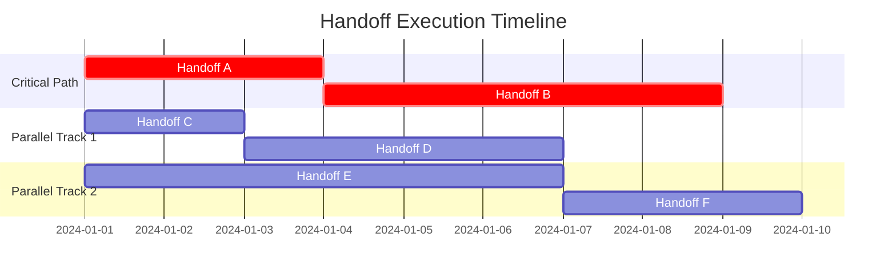

# HANDOFF: Workflow de Ejecución Sistemática de Handoffs Pendientes

## 🎯 OBJETIVO CRÍTICO
Establecer un sistema automatizado y altamente eficiente para la identificación, priorización, planificación y ejecución sistemática de handoffs pendientes, garantizando continuidad operacional, completion rate óptimo y quality assurance en todas las transferencias de trabajo.

## 📋 ESTADO DEL HANDOFF
- **Tipo**: Operational Excellence + Workflow Automation
- **Prioridad**: CRÍTICA - Backbone operacional del sistema
- **Complejidad**: MUY ALTA - Orchestration de múltiples workflows complejos
- **Impacto**: ECOSYSTEM-WIDE - Afecta delivery de todos los proyectos
- **Estimated Effort**: 12-18 horas de desarrollo + testing exhaustivo
- **Dependencies**: Handoff registry, Priority algorithms, Execution engines, Quality gates

## 🧠 CONTEXTO Y TRASFONDO

### **Problema Operacional Crítico**
El sistema actualmente tiene **múltiples handoffs pendientes** que representan:
- **Technical debt acumulado** en forma de trabajo transfer incompleto
- **Knowledge gaps** entre diferentes fases de desarrollo
- **Coordination overhead** significativo para tracking manual
- **Risk de knowledge loss** cuando handoffs quedan sin ejecutar
- **Suboptimal resource allocation** por falta de systematic prioritization

### **Current Handoff Landscape**
Según [ACTIVE_HANDOFFS_SUMMARY.md](./ACTIVE_HANDOFFS_SUMMARY.md):
- **32+ handoffs consolidados** en operación activa
- **Multiple priority levels** sin systematic execution order
- **Complex interdependencies** entre diferentes handoffs
- **Variable completion estimates** (2-29 horas por handoff)
- **Resource contention** durante execution simultánea

### **Operational Pain Points**
1. **Handoff Discovery**: Difficulty identifying all pending handoffs
2. **Priority Confusion**: No clear systematic prioritization
3. **Resource Planning**: Inadequate capacity planning for execution
4. **Dependency Management**: Complex interdependency resolution
5. **Quality Assurance**: Inconsistent completion validation
6. **Progress Tracking**: Limited visibility into execution status

## 🔄 SISTEMA DE EJECUCIÓN AUTOMATIZADA

### **Phase 1: Handoff Discovery & Inventory Management**

#### **1.1 Automated Handoff Detection**
```markdown
Task: Implement comprehensive handoff detection across the entire ecosystem
Read operations/handoffs/ACTIVE_HANDOFFS_SUMMARY.md for current inventory

DETECTION STRATEGY:
- **File System Scanning**: Search for HANDOFF_*.md files across all directories
- **Content Analysis**: Parse handoff files for status and metadata
- **Cross-Reference Validation**: Verify handoff mentions in other documents
- **Git History Analysis**: Identify handoffs created but not tracked
- **Dependency Mining**: Extract handoff interdependencies from content
- **Deadline Extraction**: Parse time-sensitive handoff requirements

AUTOMATED INVENTORY CREATION:
```json
{
  "handoff_registry": {
    "total_count": "int",
    "by_status": {
      "pending": "int",
      "in_progress": "int", 
      "blocked": "int",
      "completed": "int"
    },
    "by_priority": {
      "critical": "handoff_list",
      "high": "handoff_list",
      "medium": "handoff_list",
      "low": "handoff_list"
    },
    "by_complexity": {
      "very_high": "handoff_list",
      "high": "handoff_list", 
      "medium": "handoff_list",
      "low": "handoff_list"
    },
    "by_estimated_effort": {
      "under_4h": "handoff_list",
      "4_12h": "handoff_list",
      "12_24h": "handoff_list",
      "over_24h": "handoff_list"
    }
  }
}
```

#### **1.2 Dependency Graph Construction**
```markdown
Task: Build comprehensive dependency graph for optimal execution sequencing
Read docs/knowledge/protocols/cross-reference-dependency-detection-solution.md for framework

DEPENDENCY ANALYSIS:
- **Direct Dependencies**: Explicit handoff prerequisites
- **Implicit Dependencies**: Inferred from content analysis
- **Resource Dependencies**: Shared resource conflicts
- **Knowledge Dependencies**: Required knowledge prerequisites
- **Timing Dependencies**: Sequence-sensitive operations
- **Quality Dependencies**: Quality gate prerequisites

GRAPH CONSTRUCTION:
- Nodes: Individual handoffs with metadata
- Edges: Dependency relationships with weights
- Clusters: Related handoff groupings
- Critical Path: Longest dependency chain
- Parallel Paths: Independent execution opportunities
```

#### **1.3 Real-Time Status Tracking**
```markdown
Task: Implement real-time handoff status monitoring and updates
Read scripts/monitoring/real-time-compliance-monitor.sh for patterns

STATUS TRACKING SYSTEM:
- **Live Status Updates**: Real-time execution progress
- **Automated Status Detection**: Parse handoff files for status changes
- **Progress Metrics**: Completion percentage tracking
- **Blockers Detection**: Automatic identification of execution blockers
- **Resource Usage Monitoring**: Track resource consumption per handoff
- **Quality Gate Status**: Monitor completion criteria achievement
```

### **Phase 2: Intelligent Prioritization & Planning**

#### **2.1 Multi-Factor Priority Algorithm**
```markdown
Task: Develop sophisticated priority algorithm for optimal execution order
Read docs/knowledge/principles/principle-priority-enforcement.md for framework

PRIORITY FACTORS:
🚨 **Critical Business Impact** (Weight: 40%)
- System-blocking handoffs
- User-facing functionality
- Security/compliance requirements
- Performance bottlenecks

⏰ **Time Sensitivity** (Weight: 25%)
- Explicit deadlines
- Dependency critical path
- Resource availability windows
- External constraints

🔄 **Dependency Criticality** (Weight: 20%)
- Number of dependent handoffs
- Critical path position
- Parallelization opportunities
- Resource conflict resolution

📊 **Effort Efficiency** (Weight: 15%)
- Effort-to-impact ratio
- Resource optimization
- Quick wins identification
- Capacity utilization

ALGORITHM IMPLEMENTATION:
priority_score = (
  business_impact * 0.40 + 
  time_sensitivity * 0.25 + 
  dependency_criticality * 0.20 + 
  effort_efficiency * 0.15
) * complexity_modifier * resource_availability_modifier
```

#### **2.2 Capacity Planning & Resource Allocation**
```markdown
Task: Implement intelligent capacity planning for optimal resource utilization
Read docs/knowledge/patterns/universal-resource-allocation.md for patterns

CAPACITY PLANNING:
- **Resource Assessment**: Available development capacity analysis
- **Skill Matching**: Match handoff requirements to available expertise
- **Parallel Execution**: Identify opportunities for simultaneous work
- **Load Balancing**: Distribute work for optimal utilization
- **Bottleneck Management**: Identify and mitigate resource constraints
- **Contingency Planning**: Buffer allocation for unexpected complexity

RESOURCE ALLOCATION STRATEGY:
1. **Critical Path Resources**: Ensure critical handoffs have priority access
2. **Parallel Track Creation**: Group independent handoffs for simultaneous execution
3. **Skill Specialization**: Assign handoffs to best-matched expertise
4. **Load Distribution**: Balance workload across available resources
5. **Quality Allocation**: Reserve capacity for quality assurance activities
```

#### **2.3 Execution Timeline Generation**
```markdown
Task: Create detailed execution timeline with milestones and dependencies
Read docs/knowledge/protocols/phase-0-analysis-framework.md for timeline patterns

TIMELINE CONSTRUCTION:
- **Critical Path Analysis**: Identify longest dependency chain
- **Parallel Execution Blocks**: Group independent handoffs
- **Milestone Definition**: Key completion checkpoints
- **Buffer Allocation**: Risk mitigation time buffers
- **Resource Coordination**: Schedule resource-sharing windows
- **Quality Gates**: Integration points for quality validation

TIMELINE OUTPUT:


### **Phase 3: Automated Execution Engine**

#### **3.1 Handoff Execution Orchestrator**
```markdown
Task: Develop comprehensive execution orchestrator for automated handoff processing
Read commands/execution/execution-orchestrator.md for orchestration patterns

EXECUTION ENGINE COMPONENTS:
- **Task Dispatcher**: Intelligent assignment of handoffs to execution resources
- **Progress Monitor**: Real-time tracking of execution progress
- **Quality Controller**: Automated quality gate validation
- **Exception Handler**: Intelligent handling of execution failures
- **Resource Manager**: Dynamic resource allocation and reallocation
- **Communication Hub**: Stakeholder notification and coordination

EXECUTION WORKFLOW:
1. **Pre-Execution Validation**: Verify all prerequisites met
2. **Resource Allocation**: Assign optimal resources to handoff
3. **Execution Launch**: Initiate handoff execution with monitoring
4. **Progress Tracking**: Real-time status updates and metrics
5. **Quality Validation**: Automated completion criteria verification
6. **Post-Execution Actions**: Documentation, notification, next handoff triggering
```

#### **3.2 Quality Assurance Integration**
```markdown
Task: Integrate comprehensive quality assurance throughout execution process
Read docs/knowledge/principles/quality-assurance.md for QA framework

QUALITY GATES:
- **Pre-Execution QA**: Handoff readiness validation
- **In-Progress QA**: Continuous quality monitoring during execution
- **Completion QA**: Thorough validation of completion criteria
- **Integration QA**: Verification of handoff integration with broader system
- **Regression QA**: Ensure no negative impacts on existing functionality

AUTOMATED QA CHECKS:
✓ **Completion Criteria Validation**: All requirements met
✓ **Documentation Quality**: Standards compliance verification
✓ **Cross-Reference Integrity**: Link and reference validation
✓ **Performance Impact**: System performance regression checks
✓ **Security Compliance**: Security standards adherence
✓ **Integration Testing**: Compatibility with existing systems
```

#### **3.3 Exception Handling & Recovery**
```markdown
Task: Implement robust exception handling and recovery mechanisms
Read docs/knowledge/principles/intelligent-retry-protocol.md for patterns

EXCEPTION SCENARIOS:
- **Execution Failures**: Technical or procedural failures during execution
- **Resource Unavailability**: Key resources becoming unavailable
- **Dependency Failures**: Prerequisites failing or becoming invalid
- **Quality Gate Failures**: Failure to meet completion criteria
- **Timeline Overruns**: Execution taking longer than planned
- **External Blockers**: External dependencies causing delays

RECOVERY STRATEGIES:
1. **Automatic Retry**: Intelligent retry with exponential backoff
2. **Resource Reallocation**: Dynamic reallocation to alternative resources
3. **Dependency Resolution**: Automatic resolution of dependency issues
4. **Escalation Protocols**: Structured escalation for complex issues
5. **Alternative Path Execution**: Switch to alternative execution strategies
6. **Graceful Degradation**: Partial completion with clear continuation path
```

### **Phase 4: Advanced Optimization & Learning**

#### **4.1 Performance Analytics & Optimization**
```markdown
Task: Implement comprehensive performance analytics for continuous optimization
Read scripts/performance/execution-time-collector.py for metrics framework

PERFORMANCE METRICS:
- **Execution Efficiency**: Actual vs. estimated execution time
- **Resource Utilization**: Optimal vs. actual resource usage
- **Quality Metrics**: Quality gate pass/fail rates
- **Dependency Accuracy**: Dependency prediction accuracy
- **Priority Algorithm Effectiveness**: Priority vs. actual business impact
- **User Satisfaction**: Stakeholder feedback on execution quality

OPTIMIZATION ALGORITHMS:
- **Predictive Modeling**: ML models for improved estimation
- **Resource Optimization**: AI-driven resource allocation
- **Priority Refinement**: Continuous improvement of priority algorithms
- **Workflow Optimization**: Streamlining based on execution patterns
- **Quality Prediction**: Predictive quality assurance
```

#### **4.2 Machine Learning Integration**
```markdown
Task: Integrate ML capabilities for predictive handoff management
Read scripts/analytics/predictive-analytics.py for ML framework

ML APPLICATIONS:
- **Execution Time Prediction**: Accurate effort estimation
- **Success Probability Modeling**: Predict execution success likelihood
- **Resource Requirement Forecasting**: Optimize resource allocation
- **Quality Prediction**: Predict quality gate outcomes
- **Risk Assessment**: Identify high-risk handoffs proactively
- **Pattern Recognition**: Identify execution pattern optimizations

ML MODEL DEVELOPMENT:
1. **Data Collection**: Historical handoff execution data
2. **Feature Engineering**: Extract relevant execution characteristics
3. **Model Training**: Develop predictive models for each application
4. **Validation**: Thorough testing on historical data
5. **Deployment**: Integration with execution engine
6. **Continuous Learning**: Model updates based on new execution data
```

#### **4.3 Continuous Improvement Framework**
```markdown
Task: Establish systematic continuous improvement based on execution results
Read docs/knowledge/principles/continuous-learning-patterns.md for framework

IMPROVEMENT AREAS:
- **Process Optimization**: Streamline execution workflows
- **Tool Enhancement**: Improve automation and monitoring tools
- **Quality Improvement**: Enhance quality assurance processes
- **Communication Enhancement**: Improve stakeholder coordination
- **Resource Optimization**: Better resource allocation strategies
- **Risk Mitigation**: Improved risk identification and management

IMPROVEMENT CYCLE:
1. **Performance Analysis**: Regular review of execution metrics
2. **Gap Identification**: Identify areas for improvement
3. **Solution Development**: Design and test improvements
4. **Implementation**: Deploy improvements to production
5. **Validation**: Measure improvement effectiveness
6. **Knowledge Integration**: Update processes and documentation
```

## 🚨 CRITICAL SUCCESS FACTORS

### **Technical Requirements**
- **High Reliability**: 99.5% successful handoff execution
- **Performance Efficiency**: ≤15% overhead for execution management
- **Quality Assurance**: 100% quality gate compliance
- **Resource Optimization**: ≥85% optimal resource utilization
- **Dependency Accuracy**: ≥95% accurate dependency resolution

### **Operational Excellence**
- **Comprehensive Coverage**: 100% handoff discovery and tracking
- **Systematic Execution**: Consistent execution methodology
- **Quality Consistency**: Uniform quality standards across all handoffs
- **Stakeholder Satisfaction**: ≥95% positive feedback on execution
- **Continuous Improvement**: Measurable improvement in efficiency over time

### **Success Metrics**
- **Completion Rate**: ≥95% of planned handoffs completed on time
- **Quality Score**: ≥98% quality gate pass rate
- **Resource Efficiency**: ≤10% variance from optimal resource allocation
- **Stakeholder Satisfaction**: ≥95% positive feedback scores
- **System Reliability**: ≤1% execution engine failures

## 📚 RECURSOS Y REFERENCIAS

### **Handoff Management**
- [Active Handoffs Summary](./ACTIVE_HANDOFFS_SUMMARY.md)
- [Handoff Directory](./README.md)
- [Quality Assurance Protocols](../../docs/knowledge/principles/quality-assurance.md)

### **Execution Frameworks**
- [Execution Orchestrator](../../commands/execution/execution-orchestrator.md)
- [Parallel Coordination](../../commands/execution/parallel-coordination.md)
- [Verification Engine](../../commands/specialized-tools/verification-engine.md)

### **Monitoring & Analytics**
- [Performance Analytics](../../scripts/performance/)
- [Real-time Monitoring](../../scripts/monitoring/)
- [Predictive Analytics](../../scripts/analytics/predictive-analytics.py)

### **Quality Assurance**
- [Quality Assurance Hub](../../docs/knowledge/principles/quality-assurance-hub.md)
- [Validation Frameworks](../../docs/knowledge/principles/validation-frameworks.md)
- [Compliance Monitoring](../../scripts/compliance/)

## 🔄 PRÓXIMOS PASOS INMEDIATOS

### **Ready for Implementation**
1. **Build handoff discovery engine** con automated inventory management
2. **Develop priority algorithm** con multi-factor scoring
3. **Create execution orchestrator** con comprehensive workflow management
4. **Implement quality gates** con automated validation
5. **Establish monitoring dashboard** con real-time status tracking

### **Long-term Evolution**
1. **ML-powered optimization** basado en historical execution data
2. **Predictive handoff management** con advanced analytics
3. **Cross-project coordination** para enterprise-scale execution
4. **Intelligent resource allocation** con AI-driven optimization
5. **Self-healing execution** con automated exception recovery

---

## 📋 HANDOFF COMPLETION CRITERIA

- [ ] **Handoff discovery engine** implementado con 100% coverage
- [ ] **Priority algorithm** desarrollado con multi-factor optimization
- [ ] **Execution orchestrator** funcional con automated workflow management
- [ ] **Quality assurance system** integrado con automated validation
- [ ] **Performance monitoring** establecido con real-time analytics
- [ ] **Exception handling** implementado con automated recovery
- [ ] **Documentation completa** para todos los procedures y protocols
- [ ] **Success metrics baseline** establecido con continuous tracking

**🎯 ENTREGA OBJETIVO**: Sistema completamente automatizado para systematic execution de handoffs pendientes con high reliability, optimal efficiency y consistent quality.

---

**📅 ESTIMACIÓN TOTAL**: 12-18 horas development + 8-10 horas testing + 6-8 horas documentation = **26-36 horas total**

**🚨 DEPENDENCIES CRÍTICAS**: Handoff registry access, Execution automation framework, Quality assurance systems, Performance monitoring infrastructure, ML/AI analytics capabilities