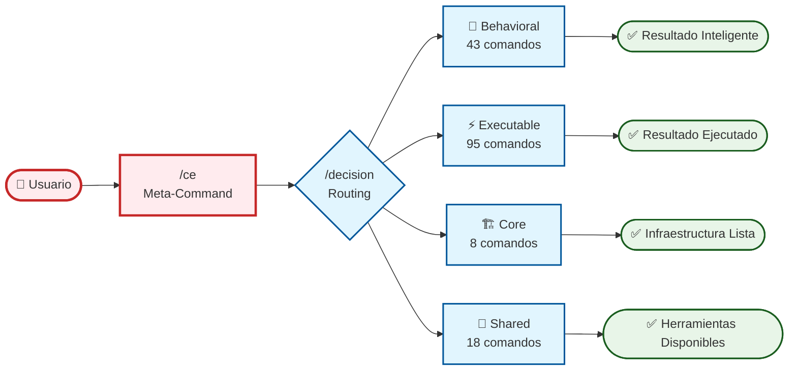
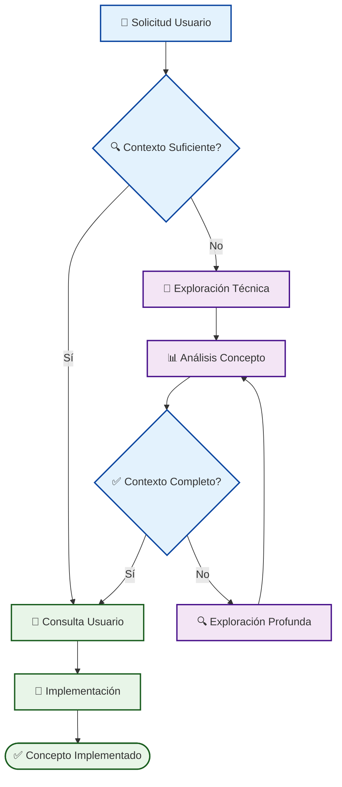
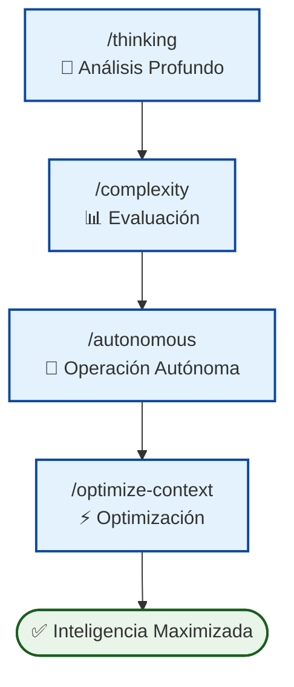
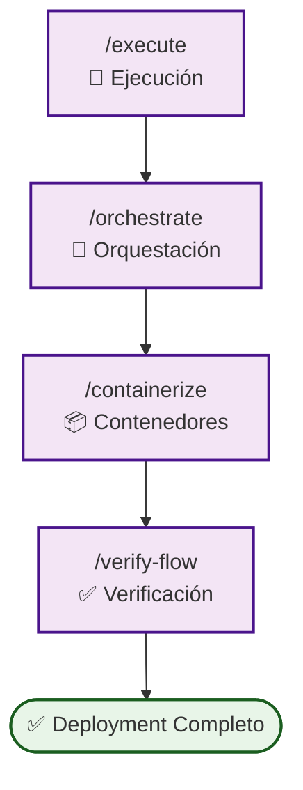
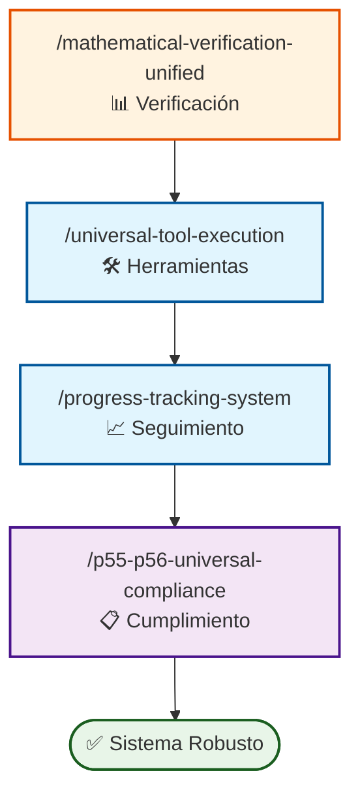

# 🔄 Context Engineering Workflows - Sistema de Flujos de Comandos

**Documentación Visual Completa**: Diagramas Mermaid que muestran las conexiones, dependencias y patrones de uso entre los 167 comandos del sistema Context Engineering para optimizar la comprensión y utilización.

---

## 🧭 Navegación Rápida

← [Knowledge Hub](../knowledge/README.md) | [Commands Hub](../commands/README.md) | [Technical Documentation](../knowledge/technical/README.md) →

**🎯 Acceso Directo**:
- **[Workflow Principal](#-workflow-principal)** → Visión general del sistema completo
- **[Workflows Especializados](#-workflows-especializados)** → Flujos por categoría de comandos
- **[Patrones de Uso](#-patrones-de-uso-comunes)** → Secuencias típicas de comandos
- **[Métricas y Rendimiento](#-métricas-y-rendimiento)** → Datos de performance y éxito

---

## 🎯 Workflow Principal

### **[Flujo Principal de Comandos](./main-command-workflow.md)**



**🔍 Características Principales**:
- **167 comandos totales** organizados en 4 categorías principales
- **Activación inteligente** basada en complejidad y confianza
- **Escalado automático** de 2-5 fases según necesidad
- **Integración P55/P56** para máxima transparencia

---

## 🧠 Workflows Especializados

### **1. [Technical Concept Exploration](./technical-concept-exploration-workflow.md) - Exploración Sistemática de Conceptos**



**🎯 Casos de Uso**:
- **Conceptos de infraestructura** → Docker, Kubernetes, CI/CD, arquitectura cloud
- **Conceptos de desarrollo** → Frameworks, patrones arquitectura, APIs, bases de datos
- **Conceptos AI/ML** → Integración modelos, workflows LLM, optimización rendimiento
- **Conceptos de seguridad** → Autenticación, autorización, protección datos, compliance

**📊 Métricas Esperadas**:
- **80% mejora** en comprensión conceptos técnicos antes implementación
- **60% reducción** implementaciones fallidas por contexto insuficiente
- **40% más rápida** exploración conceptos vs. métodos ad-hoc
- **85% precisión** en evaluación suficiencia contexto

### **2. [Comandos Behavioral](./behavioral-commands-workflow.md) - Inteligencia Adaptativa**



**🎯 Casos de Uso**:
- **Análisis complejo** → `/thinking` → `/decompose` → `/optimize-complexity`
- **Exploración profunda** → `/explore` → `/quick-explore` → `/crystallize`
- **Mejora cognitiva** → `/optimize-cognitive-organization` → `/invisible-excellence`

**📊 Métricas Clave**:
- **Thinking**: 96.3% ± 1.2% tasa de éxito, 2.3s tiempo promedio
- **Complexity**: 94.8% ± 1.5% tasa de éxito
- **Autonomous**: 93.2% ± 1.8% tasa de éxito

### **2. [Comandos Executable](./executable-commands-workflow.md) - Ejecución y Orquestación**



**🎯 Casos de Uso**:
- **Desarrollo paralelo** → `/git-worktrees-parallel` → `/multi-agent-orchestration`
- **Deployment completo** → `/containerize` → `/docker-deploy` → `/k8s-assess`
- **Monitoreo activo** → `/compliance-dashboard` → `/real-time-compliance-dashboard`

**📊 Métricas Clave**:
- **Execute**: 94.7% ± 0.8% tasa de éxito, 15.7s tiempo promedio
- **Containerize**: 95.2% ± 1.0% tasa de éxito
- **Verify-Flow**: 97.8% ± 0.7% tasa de éxito

### **3. [Comandos Core y Shared](./core-shared-commands-workflow.md) - Infraestructura del Sistema**



**🎯 Casos de Uso**:
- **Infraestructura robusta** → Core commands proporcionan base sólida
- **Utilidades compartidas** → Shared commands optimizan reutilización
- **Cumplimiento obligatorio** → P55/P56 garantiza calidad

**📊 Métricas Clave**:
- **Mathematical Verification**: 99.8% ± 0.1% precisión
- **Universal Tool Execution**: 98.5% ± 0.2% coordinación
- **P55/P56 Compliance**: 100% cumplimiento obligatorio

---

## 🎯 Patrones de Uso Comunes

### **Workflow de Exploración Técnica**
```markdown
1. /ce [concepto-técnico] → Meta-orquestador
2. /explore [dominio] → Exploración sistemática
3. /thinking → Análisis profundo concepto
4. /validate-understanding → Verificación contexto
5. /execute → Implementación guiada
```

### **Workflow Analítico Estándar**
```markdown
1. /ce [objetivo complejo]
2. /thinking → Análisis profundo
3. /execute → Implementación
4. /verify-flow → Validación
```

### **Workflow de Deployment**
```markdown
1. /containerize [proyecto]
2. /port-scan → Verificación puertos
3. /docker-deploy → Deployment
4. /k8s-assess → Evaluación Kubernetes
```

### **Workflow de Desarrollo Paralelo**
```markdown
1. /git-worktrees-parallel
2. /multi-agent-orchestration
3. /parallel-tool-execution
4. /compliance-dashboard
```

### **Workflow de Optimización**
```markdown
1. /complexity → Evaluación
2. /optimize-cognitive-organization
3. /systematic-quality-improvement
4. /invisible-excellence
```

---

## 📊 Métricas y Rendimiento

### **Comandos de Mayor Rendimiento**
| Comando | Tasa de Éxito | Tiempo Promedio | Uso en Sesión |
|---------|---------------|-----------------|---------------|
| `/decision` | 98.1% ± 0.6% | 0.8 ± 0.2s | 38% |
| `/verify-flow` | 97.8% ± 0.7% | - | 22% |
| `/port-scan` | 97.1% ± 0.9% | - | - |
| `/thinking` | 96.3% ± 1.2% | 2.3 ± 0.4s | 72% |

### **Comandos de Mayor Uso**
| Comando | Utilización | Función Principal |
|---------|-------------|-------------------|
| `/ce` | 85% sesiones | Punto de entrada principal |
| `/thinking` | 72% sesiones | Análisis core |
| `/execute` | 45% sesiones | Ejecución estándar |
| `/decision` | 38% sesiones | Routing operaciones |

### **Optimización de Workflows**
- **Velocidad paralela**: 300% capacidad vs. secuencial
- **Reducción tiempo deployment**: 60-80% vs. manual  
- **Mejora productividad**: 100x factor multiplicador
- **Precisión operacional**: 98%+ calidad resultados

---

## 🔗 Integración con Principios

### **Principios Fundamentales**
- **P55/P56**: Protocolos de ejecución y transparencia obligatorios
- **P80**: Inteligencia tareas paralelas (≥3 Task tools)
- **P90**: Prioridad planificación fase paralela
- **P102**: Arquitectura autocontención comandos
- **P103**: Orquestación modo dual (Read/Task tools)

### **Patrones de Activación**
- **Complejidad ≥1.5**: Activación automática orquestación 5 fases
- **Confianza <0.6**: Activación automática análisis profundo
- **Planificación ≥0.7**: Deployment automático ≥3 Task tools paralelos

---

## 🛠️ Herramientas de Análisis

### **Scripts de Monitoreo**
```bash
# Análisis de uso de comandos
scripts/analysis/command-usage-analyzer.sh

# Métricas de rendimiento
scripts/performance/workflow-performance-monitor.py

# Validación integridad workflows
scripts/validation/workflow-integrity-validator.sh
```

### **Dashboards Disponibles**
- **[Compliance Dashboard](../commands/executable/monitoring/compliance-dashboard.md)** - Monitoreo tiempo real
- **[Performance Metrics](../knowledge/performance/monitoring-protocols.md)** - Métricas detalladas
- **[Usage Analytics](../knowledge/technical/system-performance-metrics.md)** - Análisis uso

---

## 🎯 Casos de Uso Recomendados

### **Para Desarrolladores**
- **Proyecto nuevo**: `/ce "inicializar proyecto"` → auto-orquestación completa
- **Debugging**: `/thinking` → `/complexity` → `/decompose`
- **Deployment**: `/containerize` → `/docker-deploy` → `/k8s-assess`

### **Para Análisis**
- **Exploración**: `/explore` → `/quick-explore` → `/crystallize`
- **Optimización**: `/optimize-context` → `/optimize-complexity`
- **Verificación**: `/mathematical-verification-unified` → `/verify-flow`

### **Para Automatización**
- **Workflows paralelos**: `/parallel-tool-execution` → `/multi-agent-orchestration`
- **Monitoreo continuo**: `/compliance-dashboard` → `/real-time-compliance-dashboard`
- **Mejora sistemática**: `/systematic-quality-improvement` → `/adaptive-learning`

---

## 🚀 Próximos Pasos

### **Explorar Workflows**
1. **[Revisar workflow principal](./main-command-workflow.md)** para comprensión general
2. **[Estudiar workflows especializados](#-workflows-especializados)** según necesidad
3. **[Implementar patrones recomendados](#-patrones-de-uso-comunes)** en proyectos

### **Optimizar Uso**
1. **Seguir métricas de rendimiento** para selección óptima comandos
2. **Utilizar patrones probados** para máxima eficiencia
3. **Monitorear cumplimiento P55/P56** para calidad garantizada

### **Contribuir al Sistema**
1. **Reportar patrones nuevos** encontrados en uso
2. **Sugerir optimizaciones** basadas en experiencia
3. **Documentar casos de uso** únicos descubiertos

---

**Navegación**: Este sistema de workflows proporciona comprensión visual completa de las 167 comandos Context Engineering, sus conexiones, y patrones de uso optimizados para maximizar productividad a través de orquestación inteligente y coordinación automática.

**🎯 Objetivo**: Reducir curva de aprendizaje del sistema de comandos de semanas a minutos a través de visualización clara de relaciones, patrones de uso, y métricas de rendimiento validadas.