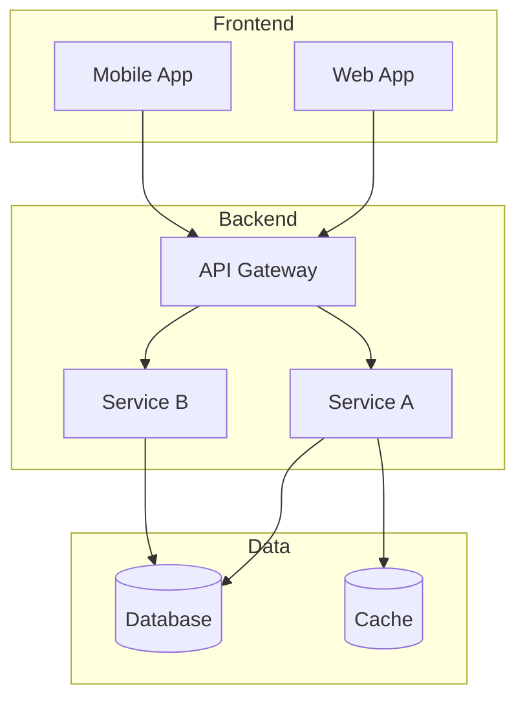

# Comando: /analyze-architecture

> **Ubicación:** `.claude/commands/analyze-architecture.md`

Analiza la arquitectura del proyecto desde múltiples perspectivas arquitectónicas usando subagentes especializados

## PROTOCOLO DE EJECUCIÓN

### FASE 1: PREPARACIÓN DEL ANÁLISIS

DETERMINAR el alcance arquitectónico:
- Nivel de abstracción requerido (sistema, aplicación, componentes)
- Aspectos específicos a analizar (diseño, patrones, decisiones)
- Formato de salida deseado (diagramas, documentación, métricas)

### FASE 2: DESPLIEGUE DE ARQUITECTOS ESPECIALIZADOS

DESPLEGAR 5 SUBAGENTES ARQUITECTOS EN PARALELO:

```bash
# USAR TASK TOOL PARA EJECUCIÓN PARALELA

TASK 1 - 🏛️ Arquitecto de Sistema:
ANALIZAR:
- Arquitectura de alto nivel (monolito, microservicios, serverless)
- Componentes principales y sus responsabilidades
- Flujos de datos entre sistemas
- Puntos de integración externos
EVALUAR:
- Escalabilidad de la arquitectura actual
- Puntos únicos de falla
- Acoplamiento entre componentes
ENTREGAR: Diagrama de arquitectura y análisis SWOT

TASK 2 - 🔌 Arquitecto de Integraciones:
EXAMINAR:
- APIs expuestas y consumidas
- Protocolos de comunicación (REST, GraphQL, gRPC)
- Patrones de integración (sync/async, pub/sub)
- Contratos y versionado
IDENTIFICAR:
- Dependencias externas críticas
- Posibles puntos de falla en integraciones
- Oportunidades de desacoplamiento
ENTREGAR: Mapa de integraciones y riesgos

TASK 3 - 📊 Arquitecto de Datos:
MAPEAR:
- Modelos de datos y sus relaciones
- Flujos de datos a través del sistema
- Estrategias de persistencia
- Patrones de acceso a datos
EVALUAR:
- Normalización vs desnormalización
- Consistencia de datos
- Estrategias de caché
ENTREGAR: Diagrama ER y estrategias de optimización

TASK 4 - 🎨 Arquitecto de Patrones:
IDENTIFICAR:
- Patrones de diseño implementados
- Patrones arquitectónicos (MVC, CQRS, Event-driven)
- Principios SOLID aplicados
- Convenciones y estándares
DETECTAR:
- Anti-patterns arquitectónicos
- Violaciones de principios
- Oportunidades de refactoring
ENTREGAR: Catálogo de patrones y recomendaciones

TASK 5 - 🔍 Arquitecto de Decisiones:
DOCUMENTAR:
- Decisiones arquitectónicas tomadas (ADRs)
- Trade-offs identificados
- Restricciones del sistema
- Deuda técnica arquitectónica
ANALIZAR:
- Decisiones que limitan evolución
- Opciones alternativas no tomadas
- Costo de cambiar decisiones
ENTREGAR: ADRs reconstruidos y análisis de impacto

# EJECUTAR TODAS LAS TASKS SIMULTÁNEAMENTE
```

### FASE 3: SÍNTESIS ARQUITECTÓNICA

CONSOLIDAR análisis de todos los arquitectos:

```markdown
## 🏗️ ANÁLISIS ARQUITECTÓNICO COMPLETO

### Resumen Ejecutivo
- **Estilo Arquitectónico**: [Monolito/Microservicios/Híbrido]
- **Madurez**: [Inicial/En evolución/Estable/Legacy]
- **Complejidad**: [Baja/Media/Alta]
- **Deuda Técnica Arquitectónica**: [Horas estimadas]

### Arquitectura de Sistema
[Síntesis del arquitecto de sistema]


### Integraciones y Dependencias
[Síntesis del arquitecto de integraciones]
- **APIs Expuestas**: [lista con versiones]
- **Servicios Externos**: [lista con criticidad]
- **Patrones de Comunicación**: [sync/async mix]

### Arquitectura de Datos
[Síntesis del arquitecto de datos]
- **Estrategia de Persistencia**: [SQL/NoSQL/Híbrido]
- **Modelo de Consistencia**: [ACID/BASE]
- **Estrategia de Cache**: [niveles y TTLs]

### Patrones Arquitectónicos
[Síntesis del arquitecto de patrones]
✅ **Bien Implementados**:
- [Patrón 1]: [dónde y por qué funciona]
- [Patrón 2]: [beneficios observados]

⚠️ **Problemas Detectados**:
- [Anti-pattern 1]: [impacto y ubicación]
- [Anti-pattern 2]: [cómo resolverlo]

### Decisiones Arquitectónicas Clave
[Síntesis del arquitecto de decisiones]
1. **[Decisión 1]**
   - Contexto: [por qué se tomó]
   - Trade-off: [qué se ganó/perdió]
   - Reversibilidad: [fácil/difícil/imposible]

### 🚨 Riesgos Arquitectónicos
1. **[Riesgo Alto]**: [descripción e impacto]
2. **[Riesgo Medio]**: [descripción y mitigación]

### 💡 Recomendaciones Evolutivas
1. **Corto Plazo** (< 3 meses):
   - [Mejora 1 de bajo riesgo]
   - [Optimización 2 rápida]

2. **Mediano Plazo** (3-6 meses):
   - [Refactoring arquitectónico 1]
   - [Migración parcial 2]

3. **Largo Plazo** (> 6 meses):
   - [Transformación arquitectónica mayor]

### 📈 Métricas Arquitectónicas
- **Modularidad**: [score 1-10]
- **Testabilidad**: [score 1-10]
- **Mantenibilidad**: [score 1-10]
- **Escalabilidad**: [score 1-10]
- **Seguridad**: [score 1-10]
```

### FASE 4: GENERACIÓN DE ARTEFACTOS

CREAR documentación arquitectónica:
```bash
# Generar diagramas
mkdir -p docs/architecture/diagrams
# Crear archivos Mermaid/PlantUML

# Generar ADRs
mkdir -p docs/architecture/decisions
# Crear ADR template para decisiones futuras

# Guardar análisis
cp [análisis] docs/architecture/analysis-[fecha].md
```

## VARIANTES DEL COMANDO

### Análisis Específico
```bash
/analyze-architecture --focus=microservices
# Solo analiza aspectos de microservicios

/analyze-architecture --focus=data-flow
# Enfoque en flujo de datos

/analyze-architecture --layer=infrastructure
# Solo capa de infraestructura
```

### Análisis Evolutivo
```bash
/analyze-architecture --evolution
# Analiza cómo ha evolucionado la arquitectura

/analyze-architecture --compare-with=[fecha]
# Compara con análisis anterior

/analyze-architecture --target-state
# Propone arquitectura objetivo
```

## INTEGRACIÓN CON OTROS COMANDOS

Este comando es invocado por:
- **`/generate-prp`**: Para entender restricciones arquitectónicas
- **`/refactor-smart`**: Para refactorings arquitectónicos
- **`/create-claude`**: Para proyectos existentes
- **`/technical-debt`**: Para evaluar deuda técnica

## OUTPUT EJEMPLO

```markdown
🏛️ Análisis Arquitectónico completado en 52 segundos

PROYECTO: E-commerce Platform
ESTILO: Microservicios con API Gateway
COMPONENTES: 6 servicios + 2 frontends

✅ FORTALEZAS:
- Separación clara de responsabilidades
- APIs bien versionadas
- Buena estrategia de cache

⚠️ DEBILIDADES:
- Acoplamiento entre servicios A y B
- Falta de circuit breakers
- Sin event sourcing para auditoría

🎯 EVOLUCIÓN RECOMENDADA:
1. Implementar patrón Saga para transacciones
2. Agregar service mesh para observabilidad
3. Migrar a event-driven para desacoplar

📊 HEALTH SCORE: 7.2/10
```

## CASOS DE USO

1. **Onboarding**: Entender arquitectura de proyecto existente
2. **Refactoring**: Identificar qué y cómo refactorizar
3. **Evolución**: Planear siguiente fase arquitectónica
4. **Auditoría**: Evaluar calidad y riesgos
5. **Documentación**: Generar diagramas actualizados