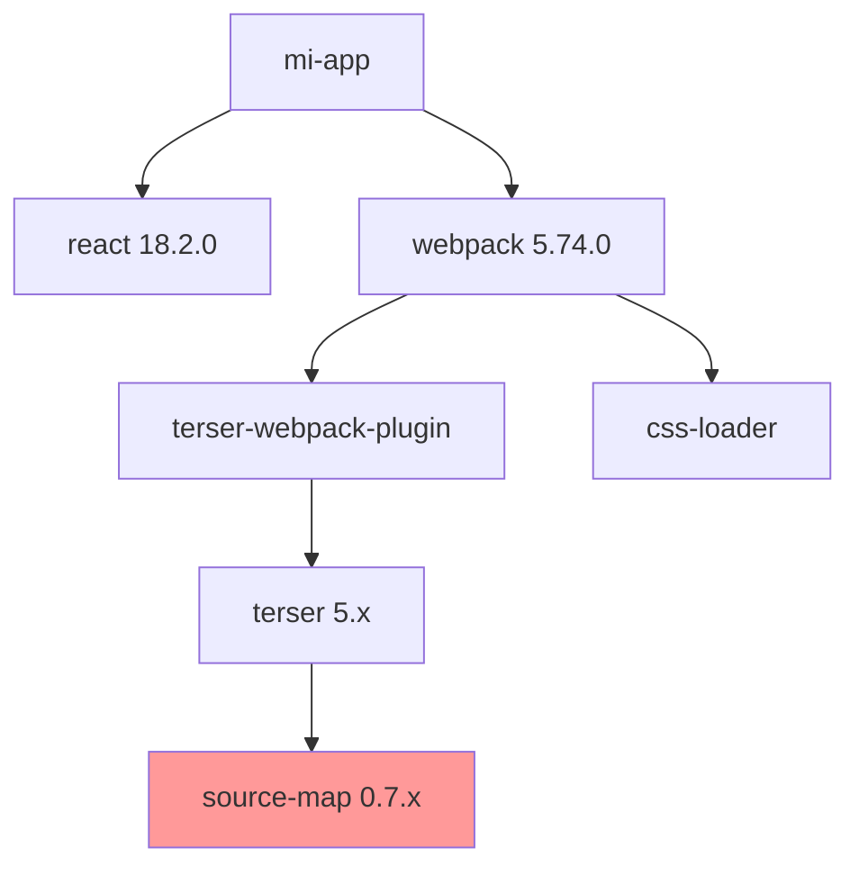

# Comando: /analyze-dependencies

> **Ubicación:** `.claude/commands/analyze-dependencies.md`

Realiza análisis profundo de la cadena de suministro de software, evaluando dependencias, vulnerabilidades y riesgos

## PROTOCOLO DE EJECUCIÓN

### FASE 1: CONFIGURACIÓN DEL ANÁLISIS

ESTABLECER parámetros de análisis:
- Ecosistemas a analizar (npm, pip, maven, go, etc.)
- Profundidad de análisis (directas, transitivas, todas)
- Políticas de licencias permitidas
- Nivel de severidad mínimo para alertas

### FASE 2: DESPLIEGUE DE ANALIZADORES ESPECIALIZADOS

DESPLEGAR 6 SUBAGENTES ANALIZADORES EN PARALELO:

```bash
# USAR TASK TOOL PARA EJECUCIÓN PARALELA

TASK 1 - 📦 Analizador de Dependencias Directas:
INVENTARIAR:
- Todas las dependencias declaradas
- Versiones exactas vs rangos
- Dependencias de desarrollo vs producción
- Dependencias opcionales/peer
EVALUAR:
- Versiones desactualizadas
- Dependencias sin uso
- Duplicados con diferentes versiones
- Incompatibilidades de versión
CALCULAR:
- Tamaño de cada dependencia
- Frecuencia de actualizaciones
- Última fecha de publicación
ENTREGAR: Inventario completo con métricas

TASK 2 - 🌳 Analizador de Árbol de Dependencias:
MAPEAR:
- Grafo completo de dependencias
- Profundidad del árbol
- Dependencias compartidas
- Ciclos de dependencia
IDENTIFICAR:
- Dependencias transitivas problemáticas
- Puntos únicos de falla
- Dependencias abandonadas en el árbol
- Conflictos de versión profundos
VISUALIZAR:
- Diagrama del árbol de dependencias
- Hot spots de complejidad
- Caminos críticos
ENTREGAR: Visualización y análisis del grafo

TASK 3 - 🔒 Analizador de Vulnerabilidades:
ESCANEAR:
- CVEs conocidos por dependencia
- Severity scores (CVSS)
- Exploits disponibles públicamente
- Fixes disponibles
EJECUTAR:
- npm/yarn audit
- Snyk/WhiteSource scan
- OWASP dependency check
- GitHub security advisories
PRIORIZAR:
- Por severidad y explotabilidad
- Por exposición en el código
- Por facilidad de actualización
ENTREGAR: Reporte de vulnerabilidades priorizado

TASK 4 - ⚖️ Analizador de Licencias:
AUDITAR:
- Licencia de cada dependencia
- Compatibilidad entre licencias
- Obligaciones de cada licencia
- Atribuciones requeridas
CLASIFICAR:
- Permisivas (MIT, Apache, BSD)
- Copyleft (GPL, AGPL, LGPL)
- Comerciales/Propietarias
- Sin licencia clara
VALIDAR:
- Compliance con políticas corporativas
- Riesgos legales potenciales
- Necesidad de atribuciones
ENTREGAR: Matriz de compliance de licencias

TASK 5 - 📊 Analizador de Calidad:
EVALUAR:
- Actividad del proyecto (commits, releases)
- Tamaño de la comunidad
- Calidad del código (si es público)
- Cobertura de tests
MÉTRICAS:
- Stars/forks en GitHub
- Número de contributors
- Frecuencia de issues/PRs
- Tiempo de respuesta a issues
CALCULAR:
- Health score por dependencia
- Riesgo de abandono
- Alternativas disponibles
ENTREGAR: Score de salud por dependencia

TASK 6 - 🔄 Analizador de Actualizaciones:
REVISAR:
- Changelog de versiones nuevas
- Breaking changes pendientes
- Esfuerzo de migración estimado
- Beneficios de actualizar
SIMULAR:
- Actualizaciones compatibles
- Impacto de actualizaciones mayores
- Cascada de actualizaciones
- Conflictos potenciales
RECOMENDAR:
- Orden óptimo de actualización
- Agrupación de actualizaciones
- Versiones objetivo
ENTREGAR: Plan de actualización priorizado

# EJECUTAR TODAS LAS TASKS SIMULTÁNEAMENTE
```

### FASE 3: CONSOLIDACIÓN Y ANÁLISIS DE RIESGOS

GENERAR evaluación integral de riesgos:

```markdown
## 📦 ANÁLISIS DE DEPENDENCIAS COMPLETO

### Resumen Ejecutivo
- **Total Dependencias**: [XXX] (directas: XX, transitivas: XXX)
- **Vulnerabilidades**: [X críticas, X altas, X medias]
- **Licencias Problemáticas**: [X]
- **Health Score**: [XX]/100
- **Deuda de Actualización**: [X meses/años]

### 📊 Inventario de Dependencias
[Síntesis del analizador de dependencias directas]

#### Top 10 Dependencias por Tamaño
| Paquete | Versión | Tamaño | Transitivas | Última Actualización |
|---------|---------|---------|-------------|---------------------|
| webpack | 5.74.0 | 12.3MB | 187 | hace 2 meses |
| react | 18.2.0 | 2.1MB | 3 | hace 6 meses |
| [etc...] |

#### Dependencias Sin Uso Detectadas
- `lodash` - No se encontraron imports
- `moment` - Reemplazable por date-fns
- `jquery` - Legacy, no necesario con React

### 🌳 Análisis del Árbol de Dependencias
[Síntesis del analizador de árbol]



#### Problemas Detectados
- **Profundidad máxima**: 8 niveles
- **Duplicados**: `source-map` (3 versiones diferentes)
- **Ciclos**: Ninguno detectado ✅

### 🔒 Vulnerabilidades de Seguridad
[Síntesis del analizador de vulnerabilidades]

#### Críticas (Acción Inmediata)
1. **CVE-2023-1234** en `example-lib@1.2.3`
   - CVSS: 9.8 (Critical)
   - Tipo: Remote Code Execution
   - Fix: Actualizar a 1.2.4
   - Usado en: `src/api/auth.js`

#### Altas
1. **CVE-2023-5678** en `old-parser@2.0.0`
   - CVSS: 7.5 (High)
   - Tipo: DoS vulnerability
   - Fix: Migrar a `new-parser`
   - Esfuerzo: Medio (cambios en API)

### ⚖️ Análisis de Licencias
[Síntesis del analizador de licencias]

#### Distribución de Licencias
- MIT: 234 (78%)
- Apache-2.0: 45 (15%)
- BSD-3: 12 (4%)
- GPL-3.0: 3 (1%) ⚠️
- Sin licencia: 6 (2%) ❌

#### Riesgos de Compliance
1. **GPL-3.0 packages**:
   - `gpl-library`: Requiere open source
   - Recomendación: Buscar alternativa MIT

2. **Sin licencia clara**:
   - `mystery-package`: Riesgo legal
   - Acción: Contactar autor o eliminar

### 📊 Salud del Ecosistema
[Síntesis del analizador de calidad]

#### Dependencias en Riesgo
| Paquete | Último Release | Contributors | Issues | Riesgo |
|---------|----------------|--------------|--------|--------|
| old-lib | 3 años | 1 | 142 | 🔴 Alto |
| unused-tool | 1 año | 3 | 67 | 🟠 Medio |

#### Métricas de Calidad
- **Bien mantenidas**: 78%
- **Actualizadas**: 65%
- **Con tests**: 82%
- **Documentadas**: 71%

### 🔄 Plan de Actualización
[Síntesis del analizador de actualizaciones]

#### Fase 1: Parches de Seguridad (Inmediato)
```bash
npm update example-lib@1.2.4
npm update other-vuln-lib@latest
# Impacto: Mínimo, backward compatible
```

#### Fase 2: Actualizaciones Menores (1 semana)
```json
{
  "react": "^18.2.0 → ^18.3.0",
  "webpack": "^5.74.0 → ^5.88.0",
  "typescript": "^4.9.0 → ^5.2.0"
}
```

#### Fase 3: Migraciones Mayores (1 mes)
1. **Webpack 5 → Vite**
   - Beneficio: 70% faster builds
   - Esfuerzo: 2-3 días
   - Guía: [link a migración]

2. **Moment.js → date-fns**
   - Beneficio: -90% bundle size
   - Esfuerzo: 1 día
   - Script automático disponible

### 📈 Métricas y Tendencias

#### Bundle Size Impact
- Total: 4.2MB (1.3MB gzipped)
- Top contributors:
  1. moment: 680KB (16%)
  2. lodash: 530KB (12%)
  3. react-icons: 420KB (10%)

#### Recomendaciones de Optimización
1. Tree-shake lodash o usar lodash-es
2. Reemplazar moment con date-fns
3. Lazy load react-icons

### 🚨 Acciones Prioritarias

1. **Inmediato** (0-24h):
   - [ ] Parchear vulnerabilidades críticas
   - [ ] Remover dependencias sin licencia

2. **Corto Plazo** (1 semana):
   - [ ] Actualizar dependencias con CVEs altos
   - [ ] Eliminar dependencias sin uso
   - [ ] Documentar decisiones de licencias

3. **Medio Plazo** (1 mes):
   - [ ] Migrar dependencias abandonadas
   - [ ] Optimizar bundle size
   - [ ] Implementar política de dependencias
```

### FASE 4: AUTOMATIZACIÓN Y MONITOREO

ESTABLECER controles continuos:
```bash
# Configurar herramientas
echo "[config]" > .dependencyrc

# Pre-commit hooks
echo "npm audit --audit-level=high" >> .git/hooks/pre-commit

# CI/CD checks
mkdir -p .github/workflows
cp [template] .github/workflows/dependency-check.yml
```

## VARIANTES DEL COMANDO

### Análisis Específico
```bash
/analyze-dependencies --type=security
# Solo vulnerabilidades de seguridad

/analyze-dependencies --licenses=strict
# Validación estricta de licencias

/analyze-dependencies --ecosystem=npm
# Solo dependencias de un ecosistema
```

### Análisis Comparativo
```bash
/analyze-dependencies --diff=main
# Cambios vs rama principal

/analyze-dependencies --cost-analysis
# Incluye análisis de costos de licencias

/analyze-dependencies --alternatives
# Sugiere alternativas para cada dependencia
```

## INTEGRACIÓN CON OTROS COMANDOS

Este comando es invocado por:
- **`/create-claude`**: Para entender stack tecnológico
- **`/analyze-security`**: Como parte del análisis de seguridad
- **`/pre-deploy`**: Validación antes de producción
- **`/tech-debt`**: Evaluación de deuda técnica

## OUTPUT EJEMPLO

```markdown
📦 Análisis de Dependencias completado en 84 segundos

PROYECTO: FinanceAI Platform
DEPENDENCIAS: 1,247 total (89 directas)
VULNERABILIDADES: 3 críticas, 7 altas

🔴 CRÍTICAS:
1. lodash@4.17.20 - Prototype pollution
2. axios@0.21.1 - SSRF vulnerability
3. node-forge@0.10.0 - Signature bypass

⚖️ LICENCIAS:
- 2 GPL packages (requieren evaluación)
- 4 sin licencia clara

💰 OPTIMIZACIONES:
- Eliminar 12 deps sin uso: -523KB
- Reemplazar moment→date-fns: -425KB
- Tree-shake lodash: -380KB

🎯 ACCIÓN INMEDIATA:
Ejecutar `/generate-prp dependency-security-fixes.md`
```

## POLÍTICAS RECOMENDADAS

1. **Aprobación para nuevas dependencias** > 100KB
2. **No dependencias con última actualización** > 2 años
3. **Licencias permitidas**: MIT, Apache-2.0, BSD, ISC
4. **Auditoría automática** en cada PR
5. **Actualización mensual** de dependencias menores