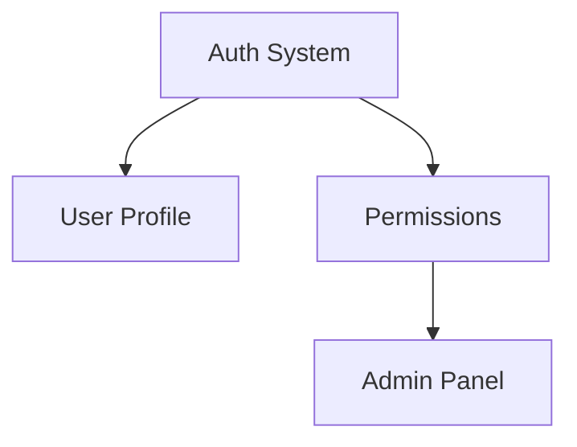

# Comando: /extract-features

> **Ubicación:** `.claude/commands/extract-features.md`

Extrae y prioriza features granulares desde CLAUDE.md y el estado actual del proyecto

## PROTOCOLO DE EJECUCIÓN

### FASE 1: ANÁLISIS DE FUENTES

EXPLORAR múltiples fuentes para identificar features:

1. **Desde CLAUDE.md**:
   - Roadmap inicial planeado
   - Features core pendientes
   - Visión no implementada

2. **Desde el código**:
   ```bash
   # TODOs y FIXMEs
   grep -r "TODO\|FIXME\|HACK" --include="*.ts" --include="*.js"
   
   # Stubs y mocks temporales
   grep -r "mock\|stub\|temporary\|placeholder" -i
   
   # Funciones no implementadas
   grep -r "throw.*not implemented\|NotImplemented"
   ```

3. **Desde comments y docs**:
   - README.md sección "Roadmap" o "Future"
   - Comentarios sobre mejoras futuras
   - Issues abiertos si usa GitHub

### FASE 2: CLASIFICACIÓN INTELIGENTE

PENSAR MÁS sobre cada feature identificada:

```markdown
# Clasificar por:

## Tipo
- 🆕 Nueva funcionalidad
- 🔧 Mejora técnica
- 🐛 Fix/Refactor necesario
- 📈 Optimización
- 🔒 Seguridad

## Tamaño (granularidad)
- XS: < 2 horas
- S: 2-4 horas  
- M: 1-2 días
- L: 3-5 días
- XL: > 1 semana (dividir en subtareas)

## Dependencies
- Bloqueada por: [otra feature]
- Bloquea a: [features dependientes]
- Independiente: puede hacerse en paralelo
```

### FASE 3: PRIORIZACIÓN AUTOMÁTICA

ULTRAPENSAR sobre criterios de priorización:

```python
# Pseudo-código de scoring
priority_score = (
    impact_usuarios * 3 +      # Valor para usuarios
    urgencia_tecnica * 2 +     # Deuda técnica/seguridad  
    facilidad_impl * 1 +       # Quick wins
    desbloquea_otras * 2       # Habilita más features
) - complejidad * 0.5         # Penalizar muy complejas
```

GENERAR matriz de priorización:

| Prioridad | Criterio | Ejemplos |
|-----------|----------|----------|
| 🔴 Crítica | Seguridad, bugs bloqueantes | Auth rota, data loss |
| 🟠 Alta | Core features faltantes | Features del MVP |
| 🟡 Media | Mejoras importantes | Performance, UX |
| 🟢 Baja | Nice to have | Polish, optimizaciones |

### FASE 4: GRANULARIZACIÓN

Para features grandes (L/XL), DESCOMPONER:

```markdown
# Feature: Sistema de Notificaciones
❌ Muy grande y vaga

✅ Descompuesta:
1. [S] Modelo de datos para notificaciones
2. [S] API endpoint para crear notificación  
3. [M] Servicio de envío de emails
4. [S] Template de email básico
5. [S] Tests de integración
6. [XS] Documentación API

Total: 6 tareas manejables vs 1 tarea abrumadora
```

### FASE 5: GENERACIÓN DE ROADMAP

CREAR documento estructurado:

```markdown
# 📋 Features Roadmap - [Proyecto]
*Generado: [fecha]*

## 🔴 Prioridad Crítica
### 1. [Feature Name] (Tamaño: S)
- **Qué**: [Descripción concisa]
- **Por qué**: [Justificación]
- **Dependencias**: Ninguna
- **Estimado**: 3 horas
- **Comando**: `/generate-prp [feature name]`

### 2. [Feature Name] (Tamaño: M)
[...]

## 🟠 Prioridad Alta
[Lista de features con mismo formato]

## 🟡 Prioridad Media
[...]

## 🟢 Backlog
[Features para futuro]

## 📊 Resumen
- Total features: [N]
- Críticas: [X]
- Estimación total: [días/semanas]
- Siguiente sprint sugerido: Features 1-5

## 🔄 Dependencias

```

### FASE 6: INTEGRACIÓN CON WORKFLOW

SUGERIR siguientes pasos:

```markdown
✅ Roadmap generado: roadmap-features.md

🎯 Para comenzar desarrollo:

1. **Quick wins** (hacer hoy):
   - Feature #3 (XS): 1 hora
   - Feature #7 (XS): 1 hora
   
2. **Siguiente PRP**:
   ```
   /generate-prp [primera feature crítica]
   ```

3. **Desarrollo paralelo** posible:
   - Terminal 1: Feature #1
   - Terminal 2: Feature #4 (independiente)
```

## CRITERIOS DE ÉXITO

- Features granulares (mayoría S/M)
- Priorización clara y justificada
- Dependencias mapeadas
- Estimaciones realistas
- Actionable inmediatamente

## ACTUALIZACIÓN CONTINUA

Ejecutar `/extract-features` cuando:
- Después de completar un sprint
- Antes de planning sessions  
- Cuando se siente que falta dirección
- Después de `/update-core`
