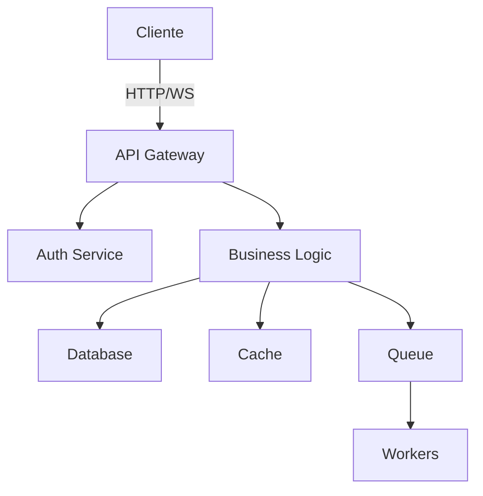

# Guía Maestra de Claude Code: De Principiante a Experto

## 📚 Tabla de Contenidos

1. [Introducción y Conceptos Fundamentales](#introducción)
2. [Configuración Inicial](#configuración-inicial)
3. [Flujos de Trabajo Esenciales](#flujos-de-trabajo)
4. [Prompt Engineering para Claude 4](#prompt-engineering)
5. [Context Engineering Avanzado](#context-engineering)
6. [Automatización y Escalamiento](#automatización)
7. [Mejores Prácticas y Reglas](#mejores-prácticas)
8. [Recursos y Referencias](#recursos)

---

## 🎯 Introducción y Conceptos Fundamentales {#introducción}

### ¿Qué es Claude Code?

Claude Code es una herramienta de línea de comandos para codificación agéntica que proporciona acceso directo a Claude sin imponer flujos de trabajo específicos. Esta flexibilidad lo convierte en una herramienta extremadamente poderosa para desarrollo de software.

### Principios Clave

1. **Context Engineering > Prompt Engineering > Vibe Coding**
   - Context Engineering es 10x mejor que prompt engineering
   - Prompt engineering es 10x mejor que "vibe coding"
   - La mayoría de fallos no son del modelo, sino de contexto

2. **Especificidad es Rey**
   - Claude 4 requiere instrucciones explícitas y detalladas
   - Los comportamientos "extra" deben solicitarse específicamente
   - Proporcionar el "por qué" mejora significativamente los resultados

3. **Automatización Inteligente**
   - Claude puede manejar tareas complejas con el contexto adecuado
   - Los flujos multi-agente multiplican la productividad
   - La validación automática asegura calidad consistente

---

## 🔧 Configuración Inicial {#configuración-inicial}

### 1. Instalación de Claude Code

```bash
# Instalar Claude Code
pip install claude-code

# Verificar instalación
claude --version
```

### 2. Estructura de Proyecto Recomendada

```
proyecto/
├── .claude/
│   ├── commands/           # Comandos slash personalizados
│   ├── settings.json       # Configuración global
│   └── settings.local.json # Configuración personal (no versionada)
├── CLAUDE.md              # Reglas y contexto del proyecto
├── CLAUDE.local.md        # Configuración personal
├── examples/              # Ejemplos de código y patrones
├── PRPs/                  # Product Requirements Prompts
└── src/                   # Código fuente
```

### 3. Archivo CLAUDE.md Efectivo

```markdown
# CLAUDE.md - Contexto del Proyecto

## Comandos Frecuentes
- npm run dev: Servidor de desarrollo
- npm run test:watch: Tests en modo watch
- npm run build: Construir para producción

## Arquitectura
- Frontend: React con TypeScript
- Backend: Node.js con Express
- Base de datos: PostgreSQL con Prisma ORM
- Testing: Jest + React Testing Library

## Convenciones de Código
- Usar TypeScript strict mode siempre
- Imports con alias: @components, @utils, @types
- Componentes funcionales con hooks
- CSS Modules para estilos

## Patrones Críticos
- SIEMPRE validar inputs de usuario
- Tests obligatorios para nueva funcionalidad
- Documentar decisiones complejas con comentarios
- Usar variables de entorno para configuración

## Estructura de Archivos
- src/components/: Componentes React reutilizables
- src/pages/: Páginas de la aplicación
- src/utils/: Funciones helper
- src/types/: Definiciones TypeScript
- src/api/: Lógica de comunicación con backend
```

### 4. Configuración de Permisos

```json
// .claude/settings.json
{
  "allowedTools": [
    "Edit",
    "Bash(git *)",
    "Bash(npm *)",
    "Bash(node *)",
    "Bash(npx *)"
  ]
}
```

### 5. GitHub CLI para Integración Completa

```bash
# Instalar GitHub CLI
brew install gh  # macOS
# o
sudo apt install gh  # Linux

# Autenticar
gh auth login
```

---

## 🔄 Flujos de Trabajo Esenciales {#flujos-de-trabajo}

### Flujo 1: Explorar → Planificar → Codificar → Commit

```bash
# 1. Exploración inicial
> explora la arquitectura del sistema de autenticación sin escribir código

# 2. Planificación profunda
> piensa profundamente sobre cómo implementar OAuth2. considera seguridad, 
  escalabilidad y experiencia de usuario. crea un plan detallado

# 3. Validar plan
> crea un documento con el plan en docs/oauth-implementation.md para revisión

# 4. Implementación
> implementa OAuth2 siguiendo el plan aprobado. verifica cada paso

# 5. Commit con contexto
> commit los cambios y crea un PR explicando la implementación
```

### Flujo 2: TDD (Test-Driven Development)

```bash
# 1. Escribir tests primero
> escribe tests completos para el sistema de notificaciones basándote en 
  estos requisitos [adjuntar requisitos]. NO implementes funcionalidad aún

# 2. Verificar que fallan
> ejecuta los tests y confirma que fallan correctamente

# 3. Implementar hasta pasar
> implementa el código mínimo necesario para que todos los tests pasen

# 4. Refactorizar
> refactoriza el código manteniendo los tests en verde
```

### Flujo 3: Debugging Eficiente

```bash
# 1. Compartir contexto del error
> estoy viendo este error cuando ejecuto npm test [pegar error completo]

# 2. Análisis profundo
> piensa sobre las posibles causas de este error considerando el contexto 
  del proyecto

# 3. Implementar solución
> implementa la solución propuesta y valida que resuelve el problema

# 4. Agregar test preventivo
> agrega un test que prevenga que este error vuelva a ocurrir
```

### Flujo 4: Code Review Inteligente

```bash
# Terminal 1: Desarrollador
> implementa sistema de caching con Redis para la API

# Terminal 2: Revisor (después de /clear)
> revisa la implementación en src/cache/ identificando:
  - problemas de seguridad
  - oportunidades de optimización
  - casos edge no considerados
  - adherencia a mejores prácticas

# Terminal 3: Integrador
> lee el código y feedback del revisor. implementa mejoras manteniendo 
  funcionalidad
```

---

## 💡 Prompt Engineering para Claude 4 {#prompt-engineering}

### Principios Fundamentales

#### 1. Especificidad Explícita

```bash
# ❌ Inefectivo
> crea un formulario de contacto

# ✅ Efectivo
> crea un formulario de contacto React con:
  - validación en tiempo real con Zod
  - manejo de errores accesible (ARIA)
  - animaciones suaves con Framer Motion
  - tema dark/light automático
  - prevención de spam con rate limiting
  - tests completos con React Testing Library
```

#### 2. Contexto y Justificación

```bash
# ❌ Sin contexto
> NO uses console.log en producción

# ✅ Con contexto
> evita console.log porque expone información sensible en producción. 
  usa un logger configurado (winston/pino) que respete niveles de log
```

#### 3. Ejemplos Consistentes

```bash
# ✅ Proporciona ejemplos que refuercen el comportamiento deseado
> implementa autenticación JWT siguiendo este patrón:

  // Ejemplo de middleware correcto
  export const authenticateToken = (req, res, next) => {
    const token = req.headers.authorization?.split(' ')[1];
    
    if (!token) {
      return res.status(401).json({ error: 'Token required' });
    }
    
    try {
      const decoded = jwt.verify(token, process.env.JWT_SECRET);
      req.user = decoded;
      next();
    } catch (error) {
      return res.status(403).json({ error: 'Invalid token' });
    }
  };
```

### Plantillas de Prompts Optimizadas

#### Para Desarrollo Frontend Excepcional

```bash
> crea una implementación del dashboard que sea visualmente impresionante. 
  no te contengas - incluye:
  - animaciones fluidas y microinteracciones
  - diseño responsive que se adapte elegantemente
  - tema dark/light con transiciones suaves
  - gráficos interactivos con D3.js
  - optimización de rendimiento (lazy loading, memoización)
  - accesibilidad WCAG 2.1 AA completa
  
  demuestra capacidades avanzadas de desarrollo web moderno
```

#### Para Arquitectura Robusta

```bash
> diseña e implementa un sistema de mensajería en tiempo real que:
  - maneje 10,000 conexiones concurrentes
  - garantice entrega de mensajes (at-least-once)
  - implemente reconnection con backoff exponencial
  - use Redis para pub/sub escalable
  - incluya rate limiting por usuario
  - proporcione métricas de rendimiento
  
  piensa profundamente sobre escalabilidad y resiliencia antes de implementar
```

#### Para Soluciones Generalizables

```bash
> implementa un parser de CSV robusto que funcione con CUALQUIER archivo CSV válido,
  no solo los casos de prueba. debe:
  - detectar automáticamente delimitadores
  - manejar encodings diversos (UTF-8, UTF-16, etc)
  - procesar archivos grandes con streaming
  - validar integridad de datos
  - proporcionar errores descriptivos
  
  NO hardcodees para casos específicos. la solución debe ser completamente general
```

### Niveles de Pensamiento Extendido

```bash
# Básico
> piensa sobre la mejor estructura de base de datos

# Profundo
> piensa profundamente sobre el modelo de datos considerando:
  - patrones de acceso actuales y futuros
  - escalabilidad horizontal
  - integridad referencial
  - optimización de queries
  - estrategia de índices

# Máximo
> ultrapiensa sobre la arquitectura completa del sistema evaluando:
  - todos los trade-offs posibles
  - implicaciones a largo plazo
  - casos edge y escenarios de falla
  - estrategias de migración
  - impacto en otros sistemas
```

---

## 🏗️ Context Engineering Avanzado {#context-engineering}

### Estructura Completa de Context Engineering

```
proyecto/
├── .claude/
│   ├── commands/
│   │   ├── generate-prp.md    # Genera PRPs automáticamente
│   │   ├── execute-prp.md     # Ejecuta PRPs
│   │   └── review-code.md     # Revisión automatizada
│   └── settings.local.json
├── PRPs/                      # Product Requirements Prompts
│   ├── templates/
│   │   └── prp_base.md
│   └── features/
├── examples/                  # CRÍTICO - Patrones a seguir
│   ├── README.md
│   ├── api/                  # Patrones de API
│   ├── components/           # Patrones de componentes
│   ├── tests/               # Patrones de testing
│   └── anti-patterns/       # Qué NO hacer
├── CLAUDE.md                # Reglas globales
├── INITIAL.md              # Template para features
└── docs/
    └── architecture.md     # Decisiones arquitectónicas
```

### Crear Examples/ Efectivos

```python
# examples/api/client.py
"""
Patrón para clientes API con retry logic y rate limiting.
Este es el patrón OBLIGATORIO para todas las integraciones API.
"""
import time
from typing import Optional, Dict, Any
from functools import wraps
import requests
from tenacity import retry, stop_after_attempt, wait_exponential

class APIClient:
    """Cliente API base con características de producción."""
    
    def __init__(self, base_url: str, api_key: str, timeout: int = 30):
        self.base_url = base_url.rstrip('/')
        self.api_key = api_key
        self.timeout = timeout
        self.session = requests.Session()
        self.session.headers.update({
            'Authorization': f'Bearer {api_key}',
            'Content-Type': 'application/json'
        })
        
    @retry(
        stop=stop_after_attempt(3),
        wait=wait_exponential(multiplier=1, min=4, max=10)
    )
    def _request(self, method: str, endpoint: str, **kwargs) -> Dict[str, Any]:
        """Ejecuta request con retry automático."""
        url = f"{self.base_url}/{endpoint.lstrip('/')}"
        
        try:
            response = self.session.request(
                method=method,
                url=url,
                timeout=self.timeout,
                **kwargs
            )
            response.raise_for_status()
            return response.json()
            
        except requests.exceptions.RequestException as e:
            # Log error con contexto completo
            logger.error(f"API request failed: {method} {url}", exc_info=True)
            raise
```

### Escribir PRPs Comprensivos

```markdown
# PRP: Sistema de Notificaciones Multi-Canal

## CONTEXT
Implementar sistema de notificaciones que soporte email, SMS, push y webhooks.
Debe ser extensible, resiliente y manejar millones de notificaciones diarias.

## MUST READ - Incluir en context window
- file: examples/queue/worker.py
  why: Patrón de workers para procesamiento asíncrono
- file: examples/api/client.py  
  why: Patrón de retry y rate limiting para APIs externas
- url: https://docs.sendgrid.com/api-reference/mail-send/mail-send
  why: API de SendGrid para emails transaccionales
- doc: https://www.twilio.com/docs/sms/quickstart/python
  section: "Error Handling"
  critical: Códigos de error específicos y estrategias de retry

## IMPLEMENTATION STEPS

### Task 1: Diseño de Arquitectura
CREAR docs/notifications-architecture.md:
- Diagrama de componentes y flujo de datos
- Decisiones de diseño y trade-offs
- Estrategia de escalamiento

### Task 2: Modelos de Datos
CREAR src/models/notification.py:
```python
from enum import Enum
from datetime import datetime
from typing import Optional, Dict, Any
from pydantic import BaseModel, Field

class NotificationChannel(str, Enum):
    EMAIL = "email"
    SMS = "sms"
    PUSH = "push"
    WEBHOOK = "webhook"

class NotificationStatus(str, Enum):
    PENDING = "pending"
    SENT = "sent"
    FAILED = "failed"
    RETRY = "retry"

class Notification(BaseModel):
    id: str = Field(default_factory=generate_uuid)
    channel: NotificationChannel
    recipient: str
    template_id: str
    context: Dict[str, Any]
    status: NotificationStatus = NotificationStatus.PENDING
    attempts: int = 0
    max_attempts: int = 3
    created_at: datetime = Field(default_factory=datetime.utcnow)
    scheduled_for: Optional[datetime] = None
    sent_at: Optional[datetime] = None
    error: Optional[str] = None
```

### Task 3: Queue y Workers
CREAR src/queue/notification_queue.py:
- SEGUIR patrón de examples/queue/worker.py
- Implementar procesamiento con prioridades
- Rate limiting por canal y recipient

### Task 4: Providers
CREAR src/providers/:
- email_provider.py (SendGrid)
- sms_provider.py (Twilio)
- push_provider.py (FCM)
- webhook_provider.py (HTTP genérico)

CADA provider DEBE:
- Heredar de BaseNotificationProvider
- Implementar retry logic específico
- Manejar rate limits del servicio
- Logear métricas de éxito/falla

### Task 5: API Endpoints
MODIFICAR src/api/routes.py:
- POST /notifications - Crear notificación
- GET /notifications/:id - Status
- POST /notifications/batch - Crear múltiples
- GET /notifications/stats - Métricas

### Task 6: Testing Comprensivo
CREAR tests/:
- test_models.py - Validación de modelos
- test_providers.py - Mock de providers
- test_queue.py - Procesamiento asíncrono
- test_api.py - Endpoints
- test_integration.py - Flujo completo

## VALIDATION
# 1. Tests unitarios
pytest tests/ -v --cov=src --cov-report=html

# 2. Test de integración local
docker-compose up -d
python scripts/test_notifications.py

# 3. Verificar métricas
curl http://localhost:8000/metrics | grep notification_

# 4. Test de carga
locust -f tests/load/notifications.py --users 100 --spawn-rate 10

## SUCCESS CRITERIA
- [ ] 100% cobertura en lógica crítica
- [ ] <100ms latencia p99 para enqueue
- [ ] Retry automático con backoff
- [ ] Rate limiting funcional
- [ ] Métricas de observabilidad
- [ ] Documentación completa
- [ ] Sin pérdida de notificaciones
```

### Comandos Slash Avanzados

```markdown
# .claude/commands/optimize-performance.md
Analiza el rendimiento del código en $ARGUMENTS:

1. PROFILE el código actual:
   - Identifica bottlenecks con cProfile/line_profiler
   - Mide memoria con memory_profiler
   - Analiza complejidad algorítmica

2. OPTIMIZA basándote en datos:
   - Reemplaza algoritmos O(n²) con O(n log n) o mejor
   - Implementa caching donde sea beneficioso
   - Usa estructuras de datos apropiadas
   - Paraleliza operaciones independientes

3. VALIDA mejoras:
   - Ejecuta benchmarks antes/después
   - Asegura que tests siguen pasando
   - Documenta cambios y resultados

4. PIENSA sobre trade-offs:
   - Complejidad vs mantenibilidad
   - Memoria vs velocidad
   - Consistencia vs rendimiento

Genera reporte con métricas específicas y recomendaciones priorizadas.
```

---

## 🤖 Automatización y Escalamiento {#automatización}

### Modo Headless para CI/CD

```bash
#!/bin/bash
# scripts/auto-review.sh

# Review automático de PRs
gh pr list --json number,title,draft | \
claude -p "analiza estos PRs y sugiere cuáles necesitan revisión prioritaria
basándote en: tamaño del cambio, edad del PR, y criticidad del título" \
--output-format json | \
jq -r '.priority_reviews[]' | \
while read pr_number; do
    echo "Revisando PR #$pr_number..."
    
    gh pr diff $pr_number | \
    claude -p "revisa este diff buscando:
    - problemas de seguridad
    - violaciones de patrones del proyecto
    - casos edge no considerados
    - oportunidades de optimización
    
    sé específico con archivo:línea en tus comentarios" \
    --allowedTools none > review_$pr_number.md
    
    # Publicar comentarios si hay issues
    if grep -q "ISSUE:" review_$pr_number.md; then
        gh pr comment $pr_number --body-file review_$pr_number.md
    fi
done
```

### Pipeline de Calidad Automatizado

```yaml
# .github/workflows/quality-check.yml
name: Quality Assurance

on: [pull_request]

jobs:
  claude-review:
    runs-on: ubuntu-latest
    steps:
      - uses: actions/checkout@v3
      
      - name: Claude Architecture Check
        run: |
          git diff origin/main..HEAD --name-only | \
          claude -p "verifica que estos archivos modificados:
          - siguen la arquitectura definida en docs/architecture.md
          - mantienen separación de responsabilidades
          - no introducen dependencias circulares
          - respetan los bounded contexts
          
          reporta cualquier violación arquitectónica" \
          --allowedTools none > architecture-check.md
          
      - name: Claude Security Audit
        run: |
          git diff origin/main..HEAD | \
          claude -p "audita este código por vulnerabilidades:
          - injection (SQL, NoSQL, command, etc)
          - XSS y problemas de sanitización
          - exposición de datos sensibles
          - problemas de autenticación/autorización
          - dependencias vulnerables
          
          usa formato: SEVERITY: [HIGH/MEDIUM/LOW] - descripción" \
          --allowedTools none > security-audit.md
          
      - name: Post Results
        if: always()
        uses: actions/github-script@v6
        with:
          script: |
            const fs = require('fs');
            const architectureCheck = fs.readFileSync('architecture-check.md', 'utf8');
            const securityAudit = fs.readFileSync('security-audit.md', 'utf8');
            
            let comment = '## 🤖 Claude Review\n\n';
            comment += '### Architecture Check\n' + architectureCheck + '\n\n';
            comment += '### Security Audit\n' + securityAudit;
            
            github.rest.issues.createComment({
              issue_number: context.issue.number,
              owner: context.repo.owner,
              repo: context.repo.repo,
              body: comment
            });
```

### Flujos Multi-Agente con Git Worktrees

```bash
#!/bin/bash
# scripts/parallel-development.sh

# Crear estructura para desarrollo paralelo
PROJECT_ROOT=$(pwd)
FEATURES=("auth-system" "payment-integration" "notification-service")

# Crear worktrees para cada feature
for feature in "${FEATURES[@]}"; do
    git worktree add ../${feature} -b feature/${feature}
done

# Lanzar Claude en cada worktree con contexto específico
for feature in "${FEATURES[@]}"; do
    cat > ../${feature}/CLAUDE.local.md << EOF
# Contexto específico para: ${feature}

## Tu misión
Implementar ${feature} siguiendo el PRP en PRPs/${feature}.md

## Dependencias
- No modifiques código fuera de tu bounded context
- Usa interfaces definidas en src/contracts/
- Comunica cambios de contrato via docs/api-changes/

## Validación continua
Después de cada cambio significativo:
1. Ejecuta tests de tu módulo
2. Ejecuta tests de integración
3. Verifica que no rompiste otros módulos
EOF

    # Iniciar Claude en nueva terminal
    osascript -e "tell app \"Terminal\" to do script \"cd ${PROJECT_ROOT}/../${feature} && claude\""
done

# Monitor central para coordinación
cat > CLAUDE_COORDINATOR.md << EOF
# Rol: Coordinador de Desarrollo

## Monitorear
- Conflictos entre features
- Cambios en contratos compartidos
- Estado de tests de integración

## Acciones
- Revisar cambios en cada worktree cada 30 minutos
- Detectar y resolver conflictos potenciales
- Mantener documentación de integración actualizada
- Crear PRs cuando features estén listas
EOF

claude
```

---

## 📋 Mejores Prácticas y Reglas {#mejores-prácticas}

### Reglas de Oro para Claude Code

#### 1. Calidad de Código

```python
# ✅ SIEMPRE incluir manejo de errores estructurado
def process_data(file_path: str) -> dict:
    """
    Procesa datos con validación completa.
    
    Args:
        file_path: Ruta al archivo
        
    Returns:
        Diccionario con datos procesados
        
    Raises:
        FileNotFoundError: Si archivo no existe
        PermissionError: Sin permisos de lectura
        ValueError: Si datos son inválidos
    """
    # Validar precondiciones
    if not os.path.exists(file_path):
        raise FileNotFoundError(f"Archivo no encontrado: {file_path}")
    
    if not os.access(file_path, os.R_OK):
        raise PermissionError(f"Sin permisos de lectura: {file_path}")
    
    try:
        with timeout(30):  # Timeout para operaciones largas
            data = _process_file_content(file_path)
            
        # Validar postcondiciones
        if not _validate_data(data):
            raise ValueError("Datos procesados no válidos")
            
        return data
        
    except Exception as e:
        logger.error(f"Error procesando {file_path}: {e}")
        raise
```

#### 2. Testing Robusto

```python
# ✅ Tests completos con casos edge
import pytest
from unittest.mock import patch, MagicMock

class TestDataProcessor:
    """Tests para procesador de datos."""
    
    @pytest.fixture
    def sample_data(self):
        """Datos de prueba reutilizables."""
        return {"test": "data"}
    
    def test_process_valid_file(self, tmp_path, sample_data):
        """Test con archivo válido."""
        # Arrange
        file_path = tmp_path / "test.json"
        file_path.write_text(json.dumps(sample_data))
        
        # Act
        result = process_data(str(file_path))
        
        # Assert
        assert result == sample_data
        assert isinstance(result, dict)
    
    def test_process_missing_file(self):
        """Test con archivo faltante."""
        with pytest.raises(FileNotFoundError) as exc_info:
            process_data("/path/inexistente.json")
        
        assert "Archivo no encontrado" in str(exc_info.value)
    
    def test_process_large_file_timeout(self, tmp_path):
        """Test timeout en archivos grandes."""
        # Crear archivo grande que tarde en procesar
        large_file = tmp_path / "large.json"
        large_file.write_text(json.dumps({"data": "x" * 10_000_000}))
        
        with patch('process_data.timeout', side_effect=TimeoutError):
            with pytest.raises(TimeoutError):
                process_data(str(large_file))
    
    @pytest.mark.parametrize("invalid_data", [
        {},                    # Vacío
        {"incomplete": True},  # Incompleto
        None,                 # Null
    ])
    def test_process_invalid_data(self, tmp_path, invalid_data):
        """Test con datos inválidos."""
        file_path = tmp_path / "invalid.json"
        file_path.write_text(json.dumps(invalid_data))
        
        with pytest.raises(ValueError):
            process_data(str(file_path))
```

#### 3. Documentación Viva

```markdown
# docs/DEVELOPMENT.md

## Guía de Desarrollo

### Setup Inicial
```bash
# Clonar repositorio
git clone <repo-url>
cd proyecto

# Crear entorno virtual
python -m venv venv
source venv/bin/activate  # Linux/Mac
# o
venv\Scripts\activate  # Windows

# Instalar dependencias
pip install -r requirements.txt
pip install -r requirements-dev.txt

# Configurar pre-commit hooks
pre-commit install

# Copiar variables de entorno
cp .env.example .env.local
# Editar .env.local con tus valores
```

### Arquitectura



### Convenciones

#### Estructura de Commits
- `feat:` Nueva funcionalidad
- `fix:` Corrección de bugs
- `docs:` Documentación
- `style:` Formato (no afecta lógica)
- `refactor:` Refactorización
- `test:` Agregar tests faltantes
- `chore:` Mantenimiento

#### Code Review Checklist
- [ ] Tests pasan localmente
- [ ] Documentación actualizada
- [ ] Sin credenciales hardcodeadas
- [ ] Manejo de errores apropiado
- [ ] Logs informativos agregados
- [ ] Performance considerada
- [ ] Seguridad validada
```

### Principios SOLID en Práctica

```python
# ✅ Single Responsibility
class UserValidator:
    """Solo valida usuarios."""
    def validate(self, user: User) -> bool:
        return all([
            self._validate_email(user.email),
            self._validate_age(user.age),
            self._validate_username(user.username)
        ])

class UserRepository:
    """Solo maneja persistencia."""
    def save(self, user: User) -> None:
        # Lógica de guardado
        pass

# ✅ Open/Closed
from abc import ABC, abstractmethod

class NotificationSender(ABC):
    @abstractmethod
    def send(self, message: str, recipient: str) -> None:
        pass

class EmailSender(NotificationSender):
    def send(self, message: str, recipient: str) -> None:
        # Implementación email
        pass

class SMSSender(NotificationSender):
    def send(self, message: str, recipient: str) -> None:
        # Implementación SMS
        pass

# ✅ Dependency Inversion
class NotificationService:
    def __init__(self, sender: NotificationSender):
        self.sender = sender  # Depende de abstracción
    
    def notify(self, message: str, recipient: str) -> None:
        self.sender.send(message, recipient)
```

---

## 📚 Recursos y Referencias {#recursos}

### Documentación Oficial
- **Claude Code:** https://claude.ai/code
- **API Documentation:** https://docs.anthropic.com
- **Prompt Engineering:** https://docs.anthropic.com/en/docs/build-with-claude/prompt-engineering/overview
- **Extended Thinking:** https://docs.anthropic.com/en/docs/build-with-claude/extended-thinking

### Herramientas Complementarias
- **MCP Servers:** https://github.com/anthropics/mcp-servers
- **GitHub CLI:** https://cli.github.com/
- **Pre-commit:** https://pre-commit.com/

### Comunidad y Soporte
- **Support:** https://support.anthropic.com
- **Twitter:** [@AnthropicAI](https://twitter.com/AnthropicAI)
- **Discord:** Comunidad de desarrolladores

### Métricas de Éxito

**Al implementar estas prácticas deberías lograr:**
- 🎯 **90%+ precisión** en primera implementación
- ⏱️ **60-80% reducción** en tiempo de desarrollo
- 🐛 **50-70% menos bugs** en producción
- 📈 **3-5x aumento** en productividad del equipo
- ✅ **95%+ adherencia** a estándares del proyecto

---

> **💡 Recuerda:** La clave del éxito con Claude Code no es solo escribir buenos prompts, sino crear un ecosistema completo de contexto que permita a Claude entender profundamente tu proyecto y objetivos. Invierte tiempo en configuración inicial y verás retornos exponenciales en productividad y calidad.