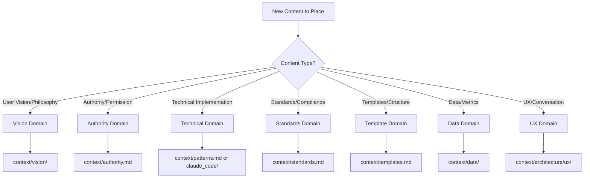
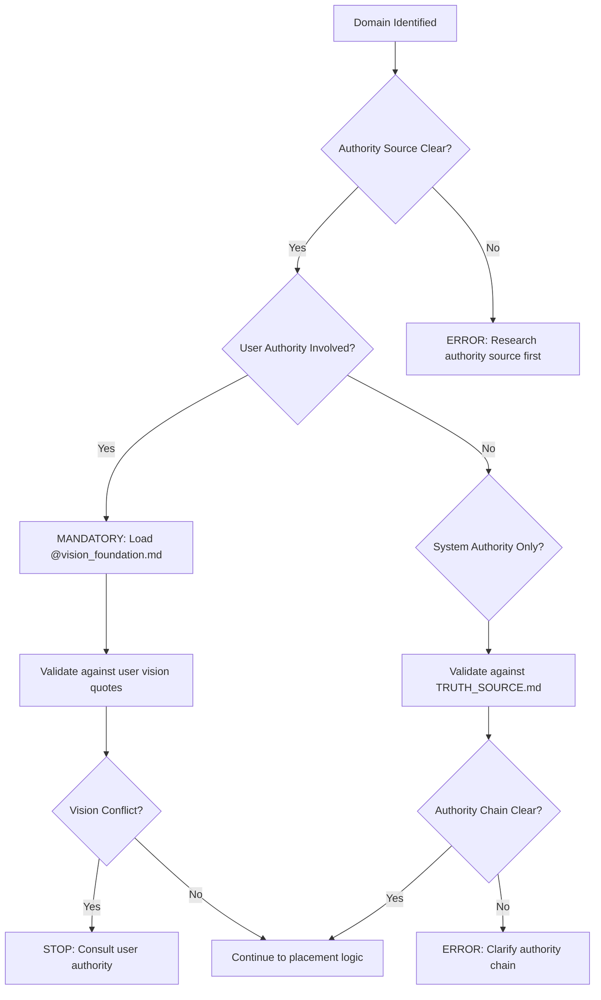
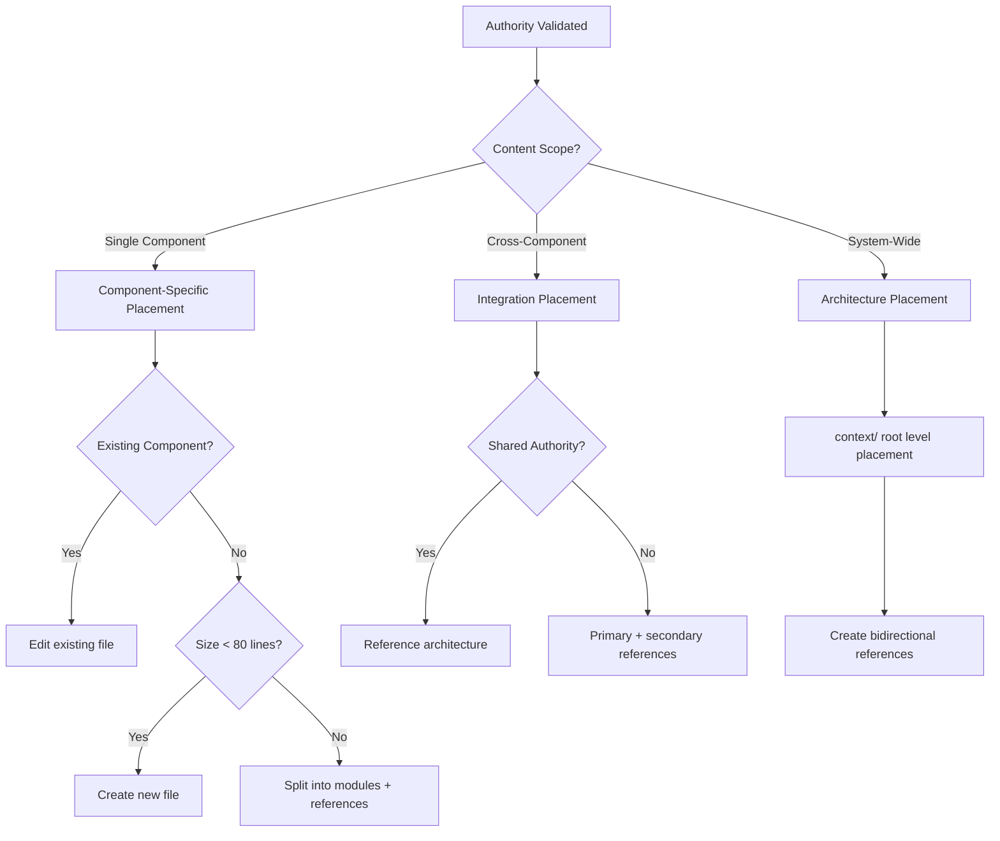
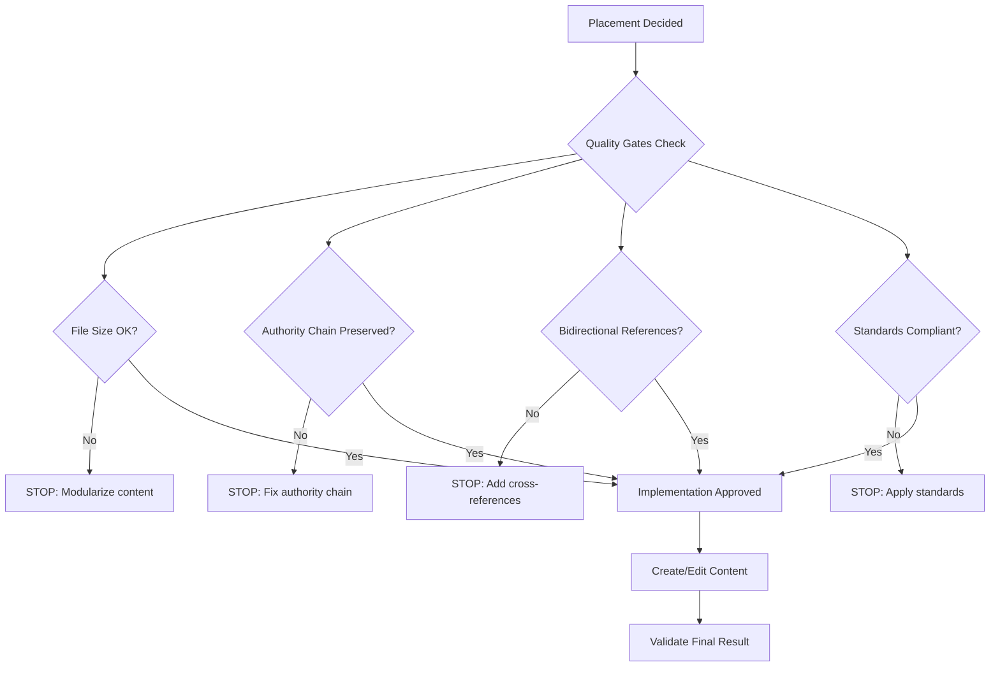

# Component Decision Flowchart - Visual Content Placement Authority

**30/07/2025 13:15 CDMX** | Systematic visual guidance for content placement decisions with authority preservation

## AUTORIDAD SUPREMA
context/principles/vision_foundation.md → TRUTH_SOURCE.md → COMPONENT_DECISION_MATRIX.md → component-decision-flowchart.md implements visual decision intelligence

## PRINCIPIO FUNDAMENTAL
**"Visual decision tree eliminates placement paralysis while preserving systematic accuracy"** - Every content placement follows clear decision pathways with authority validation at each step.

## VISUAL DECISION FLOWCHART

### **Phase 1: Content Classification**



### **Phase 2: Authority Validation**



### **Phase 3: Placement Logic Decision Tree**



### **Phase 4: Final Validation & Implementation**



## INTERACTIVE DECISION GUIDE

### **Step 1: Content Analysis Questions**

**Q1: What is the primary purpose of this content?**
- [ ] A. Define user vision/philosophy → context/vision/
- [ ] B. Establish authority/boundaries → context/authority.md
- [ ] C. Document technical patterns → context/patterns.md
- [ ] D. Specify standards/compliance → context/standards.md
- [ ] E. Provide templates/structure → context/templates.md
- [ ] F. Store data/metrics → context/data/
- [ ] G. Design UX/conversation → context/architecture/ux/

**Q2: Who has authority over this content?**
- [ ] A. User exclusively → VISION authority chain required
- [ ] B. System with user oversight → TRUTH_SOURCE validation
- [ ] C. Technical implementation → patterns/claude_code authority
- [ ] D. Shared authority → reference architecture needed

**Q3: What is the content scope?**
- [ ] A. Single component/file → component-specific placement
- [ ] B. Multiple components → integration placement required
- [ ] C. System-wide impact → architecture-level placement

### **Step 2: Placement Decision Matrix**

| Content Type | Authority | Scope | Primary Location | Secondary References |
|--------------|-----------|--------|------------------|---------------------|
| User Vision | User | System | context/vision/ | → all components |
| Authority Rules | User | System | context/authority.md | ← all authority users |
| Technical Patterns | System | Component | context/patterns.md | ← implementation users |
| Standards | System | System | context/standards.md | → specialized modules |
| Templates | System | Component | context/templates.md | ← template users |
| Data/Metrics | System | Component | context/data/ | ← data consumers |
| UX Design | System | Component | context/architecture/ux/ | ← UX implementers |

### **Step 3: Common Scenarios & Resolutions**

#### **Scenario A: New User Requirement**
**Example**: User provides new vision guidance
**Decision Path**: 
1. Content Type = Vision Domain → context/vision/
2. Authority = User Exclusive → Load vision_foundation.md
3. Scope = System-Wide → Vision-level placement
4. **Resolution**: context/vision/[specific_topic].md + references from all affected components

#### **Scenario B: Technical Implementation Pattern**
**Example**: New Claude Code tool pattern discovered
**Decision Path**:
1. Content Type = Technical Domain → context/patterns.md or claude_code/
2. Authority = System with oversight → TRUTH_SOURCE validation
3. Scope = Component-Specific → Pattern placement
4. **Resolution**: context/patterns.md (if general) or context/claude_code/methodology/ (if tool-specific)

#### **Scenario C: Cross-Component Integration**
**Example**: Authority framework needs UX integration
**Decision Path**:
1. Content Type = Multiple domains involved
2. Authority = Shared between domains
3. Scope = Cross-Component → Integration placement
4. **Resolution**: Primary in highest authority component + bidirectional references

#### **Scenario D: Standards Enforcement**
**Example**: New file size limit enforcement
**Decision Path**:
1. Content Type = Standards Domain → context/standards.md
2. Authority = System enforcement → Standards authority
3. Scope = System-Wide → Standards placement
4. **Resolution**: context/standards.md reference hub → specialized enforcement module

## ANTI-PATTERN IDENTIFICATION & PREVENTION

### **Common Placement Anti-Patterns**

#### **Anti-Pattern 1: Authority Confusion**
**Symptom**: Content with unclear authority source
**Detection**: No clear authority chain to user or system source
**Prevention**: Always validate authority source before placement
**Resolution**: Research authority source → establish clear chain → place accordingly

#### **Anti-Pattern 2: Content Duplication**
**Symptom**: Same content in multiple locations
**Detection**: Similar content across files without references
**Prevention**: Reference-only architecture for all duplicate risk content
**Resolution**: Consolidate to single source → create references from other locations

#### **Anti-Pattern 3: Monolithic Files**
**Symptom**: Files exceeding 80-line limit
**Detection**: Line count validation
**Prevention**: Modular design with reference architecture
**Resolution**: Split into specialized modules + reference hub

#### **Anti-Pattern 4: Orphaned Content**
**Symptom**: Content without clear integration pathways
**Detection**: No bidirectional references to/from content
**Prevention**: Integration pathway planning before content creation
**Resolution**: Establish integration pathways → create bidirectional references

#### **Anti-Pattern 5: Scope Mismatch**
**Symptom**: System-wide content in component-specific location
**Detection**: Content impact analysis reveals broader scope than location
**Prevention**: Scope analysis before placement decision
**Resolution**: Move to appropriate scope level → update references

## EMERGENCY PLACEMENT PROTOCOL

### **When Decision Tree Unclear**

#### **Emergency Protocol Steps**:
1. **STOP**: Do not guess placement
2. **RESEARCH**: Use semantic trigger analysis from CLAUDE.md
3. **VALIDATE**: Consult COMPONENT_DECISION_MATRIX.md integration pathways  
4. **AUTHORITY CHECK**: Validate against TRUTH_SOURCE.md authority chain
5. **TEMPORARY PLACEMENT**: If urgent, place in context/working/ with clear migration plan
6. **REVIEW**: Schedule placement review with authority validation

#### **Emergency Placement Locations**:
- **context/working/[temp_name].md**: Temporary placement during decision research
- **context/research/[topic].md**: Content requiring investigation before placement
- **context/archive/pending/[item].md**: Historical content awaiting placement decision

### **Placement Conflict Resolution**

#### **Authority Conflict Resolution**:
```
Authority Conflict Detected:
├── Identify conflicting authority sources
├── Trace to supreme authority (VISION.md)
├── Apply authority supremacy (user voice wins)
├── Update placement to reflect resolved authority
└── Document resolution in placement decision log
```

#### **Integration Conflict Resolution**:
```
Integration Conflict Detected:
├── Identify conflicting integration requirements
├── Analyze integration pathway requirements
├── Design reference architecture to satisfy all requirements
├── Implement bidirectional reference solution
└── Validate integration effectiveness
```

## CONTENT PLACEMENT QUICK REFERENCE

### **One-Page Placement Summary**

| Quick Check | Question | Answer | Action |
|-------------|----------|--------|--------|
| **Domain** | What domain? | Vision/Authority/Technical/Standards/Templates/Data/UX | Go to domain location |
| **Authority** | Who decides? | User/System/Shared | Load appropriate authority validation |
| **Scope** | How wide? | Component/Cross-Component/System | Choose appropriate placement level |
| **Size** | How big? | <80 lines/Modular | Single file or reference architecture |

### **Semantic Trigger Keywords**

#### **Vision Domain Triggers**:
- "user wants", "vision says", "philosophy", "user authority", "user preferences"

#### **Authority Domain Triggers**:
- "permission", "authority", "who decides", "domain boundaries", "user-AI separation"

#### **Technical Domain Triggers**:
- "implementation", "pattern", "method", "tool", "technique", "approach"

#### **Standards Domain Triggers**:
- "compliance", "requirement", "standard", "rule", "enforcement", "validation"

#### **Template Domain Triggers**:
- "structure", "format", "template", "example", "framework", "scaffold"

#### **Data Domain Triggers**:
- "metrics", "data", "measurement", "performance", "analytics", "validation"

#### **UX Domain Triggers**:
- "conversation", "dialogue", "user experience", "interface", "interaction"

### **Authority Chain Quick Check**

```
Authority Validation Quick Check:
├── User Vision Content → @vision_foundation.md → context/vision/
├── System Authority → @TRUTH_SOURCE.md → context/[domain].md
├── Technical Implementation → @patterns.md or @claude_code/
├── Standards Enforcement → @standards.md → specialized modules
└── Cross-Domain → Reference architecture with bidirectional links
```

## INTEGRATION WITH EXISTING SYSTEMS

### **CLAUDE.md Semantic Triggers Integration**

#### **Flowchart Integration with CLAUDE.md**:
```
CLAUDE.md Semantic Pattern Detection:
├── Pattern Identified → Load component-decision-flowchart.md
├── Authority Validation → Apply Phase 2 validation logic
├── Placement Decision → Follow Phase 3 decision tree
├── Implementation → Execute Phase 4 with quality gates
└── Post-Validation → Update COMPONENT_DECISION_MATRIX.md
```

### **COMPONENT_DECISION_MATRIX.md Integration**

#### **Bidirectional Integration Protocol**:
```
component-decision-flowchart.md ←→ COMPONENT_DECISION_MATRIX.md:
├── Flowchart provides visual decision guidance
├── Matrix provides detailed integration pathways
├── Flowchart validates against matrix authority chains
├── Matrix updates based on flowchart usage patterns
└── Both evolve together maintaining consistency
```

### **CROSS_REFERENCE_SYSTEM.md Integration**

#### **Reference Architecture Integration**:
```
Reference System Integration:
├── Flowchart placement decisions → Reference creation
├── Authority validation → Reference chain verification
├── Integration pathways → Bidirectional reference implementation
├── Quality gates → Reference integrity validation
└── Evolution protocol → Reference system adaptation
```

### **README Template System Compatibility**

#### **Template Integration Protocol**:
```
README Template Integration:
├── Component placement → README template selection
├── Authority validation → README authority section population
├── Integration design → README cross-reference section
├── Standards compliance → README standards validation
└── Evolution readiness → README evolution protocol
```

## VALIDATION AND TESTING PROTOCOL

### **Flowchart Validation Process**

#### **Test Case 1: Existing Content Validation**
```
Test Protocol:
├── Select 10 existing well-placed components
├── Run through flowchart decision process
├── Validate flowchart produces same placement decision
├── Document any flowchart adjustment needs
└── Update flowchart based on validation results
```

#### **Test Case 2: New Content Placement**
```
Test Protocol:
├── Create test content scenarios (user vision, technical pattern, standards)
├── Apply flowchart decision process
├── Validate placement effectiveness after implementation
├── Measure decision time reduction vs. pre-flowchart
└── Optimize flowchart based on effectiveness metrics
```

#### **Test Case 3: Edge Case Handling**
```
Edge Case Test Protocol:
├── Authority conflicts: Content with unclear authority source
├── Scope ambiguity: Content that could fit multiple scopes
├── Integration complexity: Content requiring multiple integration points
├── Standards violations: Content that conflicts with existing standards
└── Emergency scenarios: Urgent placement under time pressure
```

### **Flowchart Evolution and Maintenance**

#### **Evolution Trigger Monitoring**:
```
Evolution Triggers:
├── User vision changes → Flowchart authority validation updates
├── System architecture changes → Flowchart placement logic updates
├── New content types → Flowchart decision tree expansion
├── Standards evolution → Flowchart quality gate updates
└── Usage pattern changes → Flowchart optimization
```

#### **Maintenance Protocol**:
```
Quarterly Flowchart Review:
├── Analyze flowchart usage patterns and effectiveness
├── Identify common decision points causing confusion
├── Update decision tree based on evolved system architecture
├── Validate flowchart against current authority chain
├── Test flowchart with recent placement decisions
└── Document flowchart evolution for historical reference
```

#### **Continuous Improvement Process**:
```
Continuous Improvement:
├── Monitor placement decision time and accuracy
├── Collect feedback on flowchart usability
├── Track placement errors and root cause analysis
├── Optimize flowchart based on empirical evidence
└── Evolve flowchart organically with system growth
```

---

**COMPONENT DECISION FLOWCHART DECLARATION**: This visual decision system implements user vision of eliminating decision paralysis while preserving systematic accuracy. All placement decisions follow clear pathways with authority validation maintaining complete system integrity.

**INTEGRATION AUTHORITY**: ←→ COMPONENT_DECISION_MATRIX.md (detailed pathways), ←→ CROSS_REFERENCE_SYSTEM.md (reference implementation), ← CLAUDE.md (semantic trigger integration)

**EVOLUTION PATHWAY**: Flowchart evolves through usage → optimization → authority validation cycle preserving user vision supremacy and system effectiveness.