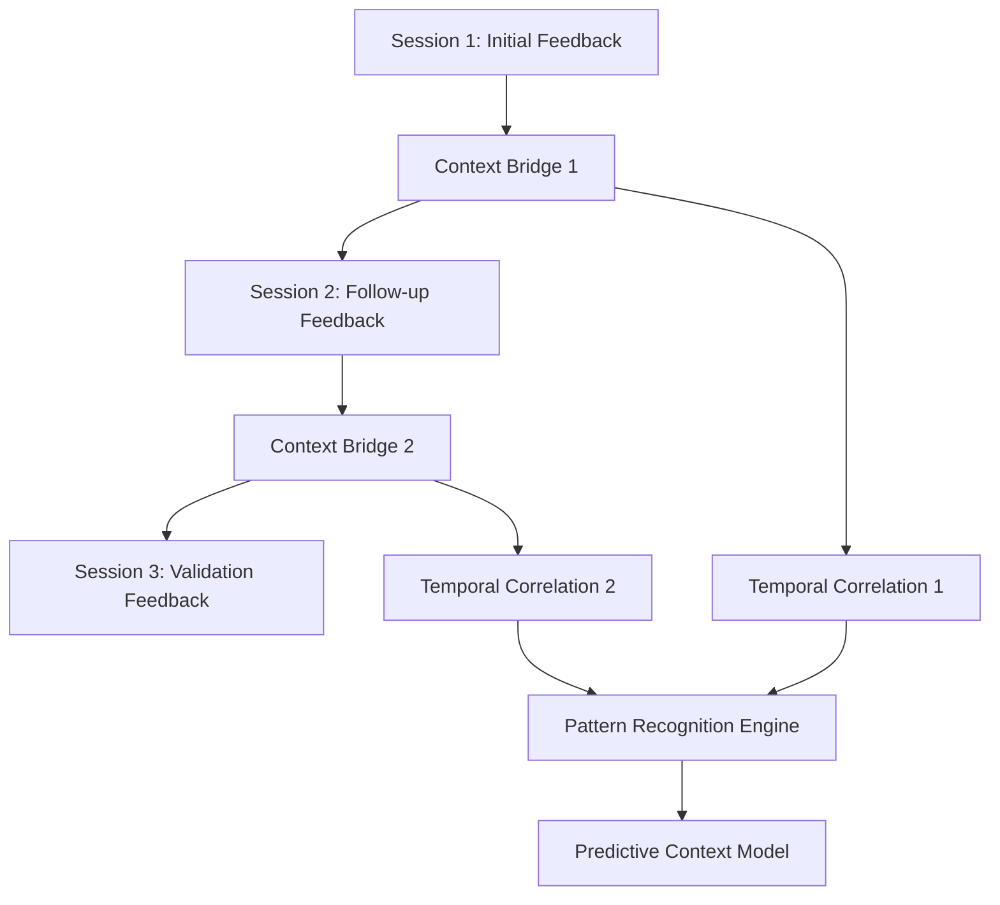

# Context Preservation Framework for User Feedback
**Version**: 1.0 | **Date**: 2025-07-26 | **Status**: Framework Specification
**Purpose**: Comprehensive context preservation system for user feedback with temporal and state-aware capabilities

## Executive Summary

The Context Preservation Framework provides comprehensive context capture, preservation, and analysis for user feedback sessions. This framework ensures complete temporal context continuity, state-aware correlation, and context-driven action recommendations while maintaining seamless user experience and complete transparency.

## Core Context Capture Mechanisms

### 1. Multi-Dimensional Context Capture

#### System State Context
```json
{
  "capture_type": "system_state",
  "timestamp": "2025-07-26T15:30:00Z",
  "git_context": {
    "branch": "feature/feedback-system",
    "commit_hash": "a1b2c3d4",
    "modified_files": ["context-engine.md", "feedback-capture.py"],
    "working_directory_state": "clean|modified|conflict"
  },
  "performance_context": {
    "active_commands": ["explore-codebase", "analyze-parallel"],
    "parallel_agents": 6,
    "system_load": 0.65,
    "memory_usage": "2.1GB"
  },
  "user_workflow_context": {
    "current_session_duration": "45min",
    "commands_executed": 12,
    "last_action": "validate-complete",
    "workflow_stage": "implementation_phase"
  }
}
```

#### User Interaction Context
```json
{
  "capture_type": "user_interaction",
  "session_id": "feedback_session_20250726_1530",
  "interaction_sequence": [
    {
      "timestamp": "2025-07-26T15:25:00Z",
      "user_action": "command_execution",
      "command": "/explore-codebase",
      "user_satisfaction": 8,
      "context_note": "Found relevant patterns quickly"
    },
    {
      "timestamp": "2025-07-26T15:28:00Z",
      "user_action": "feedback_provided",
      "feedback_type": "logros",
      "content": "The parallel search worked very well",
      "emotional_state": "satisfied"
    }
  ],
  "user_preferences": {
    "parallel_preference": "high",
    "detail_level": "comprehensive",
    "language_preference": "spanish_english_mix"
  }
}
```

#### Environmental Context
```json
{
  "capture_type": "environmental",
  "environment": {
    "platform": "claude_code",
    "workspace": "/Users/nalve/ce-simple",
    "active_files": ["CLAUDE.md", "context-engine.md"],
    "recent_modifications": [
      {
        "file": "rules/context-optimization-protocols.md",
        "timestamp": "2025-07-26T15:20:00Z",
        "change_type": "content_addition"
      }
    ]
  },
  "temporal_context": {
    "time_of_day": "afternoon",
    "session_duration": 45,
    "previous_session": "2025-07-25T14:00:00Z",
    "session_continuity": true
  }
}
```

### 2. Contextual Metadata Collection System

#### Metadata Schema
```yaml
context_metadata:
  core_identifiers:
    feedback_id: "fb_20250726_1530_001"
    session_id: "session_20250726_1530"
    user_id: "user_anonymous_001"
    correlation_id: "corr_feedback_implementation_phase"
  
  temporal_markers:
    absolute_timestamp: "2025-07-26T15:30:00Z"
    relative_session_time: 1800  # seconds from session start
    workflow_phase_duration: 2700  # seconds in current phase
    last_feedback_interval: 300  # seconds since last feedback
  
  system_state_markers:
    git_state_hash: "sha256:abc123..."
    performance_baseline: 0.65
    active_processes: ["explore", "analyze", "validate"]
    context_economy_score: 85
  
  relationship_markers:
    previous_feedback_ids: ["fb_20250726_1525_001"]
    related_commands: ["/explore-codebase", "/analyze-parallel"]
    affected_files: ["context-engine.md", "feedback-system.py"]
    correlation_tags: ["performance", "parallelization", "user_satisfaction"]
```

#### Metadata Collection Protocols
```python
class ContextMetadataCollector:
    def capture_metadata(self, feedback_event):
        return {
            'collection_timestamp': self.get_current_timestamp(),
            'system_snapshot': self.capture_system_state(),
            'user_context': self.capture_user_context(),
            'session_context': self.capture_session_context(),
            'correlation_markers': self.generate_correlation_markers(),
            'quality_indicators': self.assess_context_quality()
        }
    
    def generate_correlation_markers(self):
        return {
            'temporal_correlations': self.find_temporal_patterns(),
            'functional_correlations': self.find_functional_relationships(),
            'causal_correlations': self.identify_causal_chains(),
            'predictive_markers': self.generate_predictive_indicators()
        }
```

## Temporal Context Preservation

### 1. Cross-Session Context Continuity

#### Session Linking Protocol
```json
{
  "session_continuity": {
    "current_session": "session_20250726_1530",
    "previous_session": "session_20250725_1400",
    "continuity_score": 0.85,
    "context_bridge": {
      "carried_forward_context": [
        "user_satisfaction_trends",
        "performance_optimization_focus",
        "parallelization_preferences"
      ],
      "evolution_markers": [
        {
          "context_element": "user_satisfaction_score",
          "previous_value": 7.2,
          "current_value": 8.1,
          "trend": "improving",
          "confidence": 0.92
        }
      ]
    }
  }
}
```

#### Temporal Context Graph


### 2. Context State Evolution Tracking

#### State Evolution Schema
```yaml
context_evolution:
  evolution_id: "ctx_evol_20250726"
  baseline_context:
    timestamp: "2025-07-26T15:00:00Z"
    state_hash: "baseline_abc123"
    key_metrics:
      user_satisfaction: 7.2
      system_performance: 0.62
      parallelization_effectiveness: 0.78
  
  evolution_deltas:
    - delta_id: "delta_001"
      timestamp: "2025-07-26T15:30:00Z"
      changes:
        user_satisfaction: +0.9
        system_performance: +0.03
        parallelization_effectiveness: +0.12
      trigger_events:
        - "successful_parallel_execution"
        - "positive_user_feedback"
      confidence_score: 0.94
  
  predictive_trajectory:
    predicted_satisfaction: 8.5
    confidence_interval: [8.2, 8.8]
    prediction_horizon: "30_minutes"
    key_influencing_factors:
      - "continued_parallel_success"
      - "maintained_transparency"
```

## Context Linking and State Correlation

### 1. Feedback-System State Correlation

#### Correlation Engine
```python
class ContextCorrelationEngine:
    def correlate_feedback_with_system_state(self, feedback, system_state):
        correlation_analysis = {
            'direct_correlations': self.identify_direct_correlations(feedback, system_state),
            'indirect_correlations': self.identify_indirect_correlations(feedback, system_state),
            'causal_relationships': self.analyze_causal_relationships(feedback, system_state),
            'predictive_correlations': self.generate_predictive_correlations(feedback, system_state)
        }
        return correlation_analysis
    
    def identify_direct_correlations(self, feedback, system_state):
        return {
            'performance_satisfaction': self.correlate_performance_metrics(feedback.satisfaction_score, system_state.performance_metrics),
            'feature_usage': self.correlate_feature_satisfaction(feedback.feature_mentions, system_state.active_features),
            'error_occurrence': self.correlate_negative_feedback(feedback.error_reports, system_state.error_logs)
        }
```

#### State Correlation Matrix
```json
{
  "correlation_matrix": {
    "feedback_satisfaction": {
      "system_performance": 0.87,
      "parallel_efficiency": 0.92,
      "response_time": -0.74,
      "error_rate": -0.89
    },
    "feedback_frequency": {
      "session_duration": 0.65,
      "command_complexity": 0.78,
      "user_engagement": 0.91
    },
    "feedback_category_distribution": {
      "logros": {"system_performance": 0.85},
      "desafios": {"complexity_level": 0.72},
      "errores": {"error_rate": 0.94},
      "obstaculos": {"workflow_friction": 0.88},
      "aprendizajes": {"system_evolution": 0.79}
    }
  }
}
```

### 2. Context-Aware Feedback Analysis

#### Advanced Analysis Engine
```python
class ContextAwareFeedbackAnalyzer:
    def analyze_with_context(self, feedback, preserved_context):
        analysis = {
            'contextual_sentiment': self.analyze_contextual_sentiment(feedback, preserved_context),
            'temporal_patterns': self.identify_temporal_patterns(feedback, preserved_context),
            'causal_attribution': self.attribute_causal_factors(feedback, preserved_context),
            'predictive_insights': self.generate_predictive_insights(feedback, preserved_context),
            'recommendation_engine': self.generate_context_recommendations(feedback, preserved_context)
        }
        return analysis
    
    def analyze_contextual_sentiment(self, feedback, context):
        return {
            'absolute_sentiment': self.calculate_absolute_sentiment(feedback),
            'relative_sentiment': self.calculate_relative_sentiment(feedback, context.previous_feedback),
            'context_influenced_sentiment': self.adjust_sentiment_for_context(feedback, context.system_state),
            'sentiment_trajectory': self.predict_sentiment_trajectory(feedback, context.temporal_context)
        }
```

## Context Capture Command Specifications

### 1. Real-Time Context Capture Command

```markdown
# /context-capture-realtime

## Purpose
Capture comprehensive context during user feedback sessions with minimal workflow disruption.

## Execution Pattern
```bash
# Parallel context capture across multiple dimensions
Agent 1: Git state and repository context capture
Agent 2: System performance and resource context capture  
Agent 3: User interaction and session context capture
Agent 4: Environmental and temporal context capture
```

## Context Capture Specification
```yaml
capture_configuration:
  capture_frequency: "event_triggered"  # real-time, periodic, event_triggered
  capture_depth: "comprehensive"       # minimal, standard, comprehensive
  storage_format: "structured_json"    # json, yaml, binary
  compression: "context_aware"         # none, standard, context_aware
  retention_policy: "indefinite"       # session, week, month, indefinite
  
capture_triggers:
  user_feedback_events: true
  system_performance_changes: true
  error_occurrences: true
  satisfaction_score_changes: true
  workflow_phase_transitions: true

context_dimensions:
  system_state:
    git_context: true
    performance_metrics: true
    active_processes: true
    resource_utilization: true
  
  user_context:
    interaction_history: true
    preference_patterns: true
    satisfaction_trends: true
    behavioral_indicators: true
  
  temporal_context:
    session_timeline: true
    workflow_progression: true
    historical_correlation: true
    predictive_markers: true
  
  environmental_context:
    platform_state: true
    workspace_context: true
    external_factors: true
    configuration_state: true
```
```

### 2. Context Preservation Command

```markdown
# /context-preserve

## Purpose
Preserve captured context with temporal correlation and cross-session continuity.

## Preservation Protocol
```python
class ContextPreservationEngine:
    def preserve_context(self, captured_context):
        preservation_result = {
            'preserved_context_id': self.generate_context_id(),
            'preservation_timestamp': self.get_current_timestamp(),
            'context_integrity_hash': self.calculate_integrity_hash(captured_context),
            'temporal_linkage': self.establish_temporal_linkage(captured_context),
            'cross_session_continuity': self.maintain_session_continuity(captured_context),
            'correlation_markers': self.generate_correlation_markers(captured_context),
            'retrieval_indices': self.create_retrieval_indices(captured_context)
        }
        return preservation_result
```

## Storage Architecture
```yaml
context_storage:
  primary_storage:
    format: "structured_json"
    location: "data/context-preservation/"
    partitioning: "temporal_hash"
    indexing: "multi_dimensional"
  
  temporal_storage:
    format: "time_series_db"
    location: "data/temporal-context/"
    retention: "indefinite"
    compression: "context_aware"
  
  correlation_storage:
    format: "graph_database"
    location: "data/context-correlations/"
    indexing: "relationship_optimized"
    query_optimization: "pattern_recognition"
```
```

### 3. Context Retrieval and Analysis Command

```markdown
# /context-analyze

## Purpose
Retrieve and analyze preserved context for pattern recognition and recommendation generation.

## Analysis Framework
```python
class ContextAnalysisEngine:
    def analyze_preserved_context(self, analysis_request):
        analysis_result = {
            'temporal_analysis': self.analyze_temporal_patterns(analysis_request),
            'correlation_analysis': self.analyze_correlations(analysis_request),
            'pattern_recognition': self.recognize_patterns(analysis_request),
            'anomaly_detection': self.detect_anomalies(analysis_request),
            'predictive_modeling': self.generate_predictions(analysis_request),
            'recommendation_engine': self.generate_recommendations(analysis_request)
        }
        return analysis_result
```

## Query Capabilities
```yaml
query_types:
  temporal_queries:
    - "feedback_patterns_over_time"
    - "satisfaction_trends_analysis"
    - "performance_correlation_timeline"
    - "user_behavior_evolution"
  
  correlation_queries:
    - "feedback_system_state_correlation"
    - "user_satisfaction_performance_correlation"
    - "error_context_correlation"
    - "feature_usage_satisfaction_correlation"
  
  pattern_queries:
    - "recurring_feedback_patterns"
    - "satisfaction_cycle_patterns"
    - "performance_impact_patterns"
    - "user_preference_patterns"
  
  predictive_queries:
    - "satisfaction_trajectory_prediction"
    - "performance_impact_prediction"
    - "user_behavior_prediction"
    - "system_optimization_recommendations"
```
```

## Context Storage and Retrieval Protocols

### 1. Storage Architecture

#### Hierarchical Storage System
```
data/
├── context-preservation/
│   ├── sessions/                    # Session-level context
│   │   ├── 2025-07-26/
│   │   │   ├── session_1530_context.json
│   │   │   ├── session_1530_metadata.json
│   │   │   └── session_1530_correlations.json
│   │   └── indices/
│   │       ├── temporal_index.json
│   │       ├── correlation_index.json
│   │       └── search_index.json
│   ├── temporal/                    # Time-series context data
│   │   ├── satisfaction_trends.tsdb
│   │   ├── performance_correlations.tsdb
│   │   └── user_behavior_patterns.tsdb
│   ├── correlations/               # Context relationship graphs
│   │   ├── feedback_system_correlations.graph
│   │   ├── temporal_correlations.graph
│   │   └── causal_relationships.graph
│   └── analytics/                  # Processed context insights
│       ├── pattern_recognition/
│       ├── anomaly_detection/
│       └── predictive_models/
```

#### Storage Specifications
```yaml
storage_configuration:
  session_context:
    format: "structured_json"
    compression: "gzip"
    indexing: "multi_field"
    retention: "indefinite"
    backup_frequency: "daily"
  
  temporal_context:
    format: "time_series"
    sampling_rate: "event_driven"
    aggregation_levels: ["minute", "hour", "day", "week"]
    compression: "context_aware"
    retention: "2_years"
  
  correlation_context:
    format: "graph_database"
    relationship_types: ["temporal", "causal", "functional", "predictive"]
    indexing: "relationship_optimized"
    query_optimization: "pattern_matching"
    retention: "indefinite"
```

### 2. Context Retrieval Engine

```python
class ContextRetrievalEngine:
    def __init__(self):
        self.temporal_index = TemporalIndex()
        self.correlation_graph = CorrelationGraph()
        self.pattern_matcher = PatternMatcher()
        self.context_cache = ContextCache()
    
    def retrieve_context(self, retrieval_request):
        """Retrieve context based on multiple criteria"""
        retrieval_result = {
            'exact_matches': self.retrieve_exact_matches(retrieval_request),
            'temporal_neighbors': self.retrieve_temporal_neighbors(retrieval_request),
            'correlation_matches': self.retrieve_correlation_matches(retrieval_request),
            'pattern_matches': self.retrieve_pattern_matches(retrieval_request),
            'predictive_context': self.retrieve_predictive_context(retrieval_request)
        }
        return retrieval_result
    
    def retrieve_exact_matches(self, request):
        """Retrieve exact context matches"""
        return self.context_store.query(
            session_id=request.session_id,
            timestamp_range=request.timestamp_range,
            context_type=request.context_type
        )
    
    def retrieve_temporal_neighbors(self, request):
        """Retrieve temporally related context"""
        return self.temporal_index.find_neighbors(
            reference_timestamp=request.timestamp,
            window_size=request.temporal_window,
            similarity_threshold=request.similarity_threshold
        )
    
    def retrieve_correlation_matches(self, request):
        """Retrieve contextually correlated feedback/states"""
        return self.correlation_graph.find_correlations(
            context_signature=request.context_signature,
            correlation_types=request.correlation_types,
            minimum_correlation=request.minimum_correlation
        )
```

## Context-Aware Feedback Processing Pipelines

### 1. Real-Time Processing Pipeline

```python
class RealTimeFeedbackProcessor:
    def __init__(self):
        self.context_capturer = ContextCapturer()
        self.context_correlator = ContextCorrelator()
        self.pattern_recognizer = PatternRecognizer()
        self.anomaly_detector = AnomalyDetector()
        self.recommendation_engine = RecommendationEngine()
    
    async def process_feedback_with_context(self, feedback_event):
        """Process feedback with full context awareness"""
        
        # Stage 1: Capture comprehensive context
        captured_context = await self.context_capturer.capture_realtime_context(feedback_event)
        
        # Stage 2: Correlate with historical context
        context_correlations = await self.context_correlator.correlate_context(
            current_context=captured_context,
            historical_context=self.retrieve_relevant_history(feedback_event)
        )
        
        # Stage 3: Pattern recognition
        identified_patterns = await self.pattern_recognizer.recognize_patterns(
            feedback=feedback_event,
            context=captured_context,
            correlations=context_correlations
        )
        
        # Stage 4: Anomaly detection
        anomalies = await self.anomaly_detector.detect_anomalies(
            feedback=feedback_event,
            context=captured_context,
            expected_patterns=identified_patterns
        )
        
        # Stage 5: Generate context-aware recommendations
        recommendations = await self.recommendation_engine.generate_recommendations(
            feedback=feedback_event,
            context=captured_context,
            patterns=identified_patterns,
            anomalies=anomalies
        )
        
        # Stage 6: Preserve enriched context
        enriched_context = self.enrich_context(
            original_context=captured_context,
            correlations=context_correlations,
            patterns=identified_patterns,
            recommendations=recommendations
        )
        
        await self.context_preserver.preserve_context(enriched_context)
        
        return {
            'processed_feedback': feedback_event,
            'context_analysis': captured_context,
            'correlations': context_correlations,
            'patterns': identified_patterns,
            'anomalies': anomalies,
            'recommendations': recommendations,
            'preservation_result': enriched_context
        }
```

### 2. Batch Processing Pipeline

```python
class BatchFeedbackProcessor:
    def __init__(self):
        self.trend_analyzer = TrendAnalyzer()
        self.pattern_aggregator = PatternAggregator()
        self.correlation_analyzer = CorrelationAnalyzer()
        self.predictive_modeler = PredictiveModeler()
    
    async def process_feedback_batch(self, feedback_batch, time_window):
        """Process feedback batch with temporal context analysis"""
        
        # Stage 1: Temporal trend analysis
        temporal_trends = await self.trend_analyzer.analyze_trends(
            feedback_batch=feedback_batch,
            time_window=time_window,
            context_correlation=True
        )
        
        # Stage 2: Pattern aggregation across sessions
        aggregated_patterns = await self.pattern_aggregator.aggregate_patterns(
            feedback_batch=feedback_batch,
            temporal_trends=temporal_trends
        )
        
        # Stage 3: Cross-context correlation analysis
        cross_correlations = await self.correlation_analyzer.analyze_cross_correlations(
            feedback_batch=feedback_batch,
            context_batch=self.retrieve_context_batch(feedback_batch)
        )
        
        # Stage 4: Predictive model updates
        updated_models = await self.predictive_modeler.update_models(
            historical_data=feedback_batch,
            trends=temporal_trends,
            patterns=aggregated_patterns,
            correlations=cross_correlations
        )
        
        return {
            'batch_analysis': {
                'temporal_trends': temporal_trends,
                'aggregated_patterns': aggregated_patterns,
                'cross_correlations': cross_correlations,
                'updated_models': updated_models
            },
            'actionable_insights': self.extract_actionable_insights(temporal_trends, aggregated_patterns),
            'system_recommendations': self.generate_system_recommendations(updated_models)
        }
```

## Context Visualization and Reporting Dashboards

### 1. Real-Time Context Dashboard

```html
<!-- Real-Time Context Preservation Dashboard -->
<div class="context-dashboard">
    <div class="context-capture-panel">
        <h3>Active Context Capture</h3>
        <div class="capture-metrics">
            <div class="metric">
                <span class="label">Capture Rate</span>
                <span class="value">98.5%</span>
            </div>
            <div class="metric">
                <span class="label">Context Dimensions</span>
                <span class="value">4/4 Active</span>
            </div>
            <div class="metric">
                <span class="label">Correlation Score</span>
                <span class="value">0.92</span>
            </div>
        </div>
    </div>
    
    <div class="temporal-context-panel">
        <h3>Temporal Context Flow</h3>
        <div class="context-timeline">
            <!-- Interactive timeline visualization -->
            <canvas id="contextTimeline"></canvas>
        </div>
    </div>
    
    <div class="correlation-panel">
        <h3>Context Correlations</h3>
        <div class="correlation-graph">
            <!-- Real-time correlation network -->
            <svg id="correlationNetwork"></svg>
        </div>
    </div>
    
    <div class="pattern-detection-panel">
        <h3>Pattern Recognition</h3>
        <div class="pattern-alerts">
            <!-- Real-time pattern alerts -->
            <div class="pattern-alert positive">
                <span class="pattern">User Satisfaction Trend</span>
                <span class="confidence">94% confidence</span>
            </div>
        </div>
    </div>
</div>
```

### 2. Context Analysis Reports

```python
class ContextReportGenerator:
    def generate_context_preservation_report(self, time_range):
        """Generate comprehensive context preservation report"""
        
        report = {
            'report_metadata': {
                'generated_at': self.get_current_timestamp(),
                'time_range': time_range,
                'report_type': 'context_preservation_analysis'
            },
            'preservation_metrics': self.calculate_preservation_metrics(time_range),
            'temporal_analysis': self.analyze_temporal_context(time_range),
            'correlation_insights': self.analyze_correlations(time_range),
            'pattern_discoveries': self.identify_patterns(time_range),
            'quality_assessment': self.assess_context_quality(time_range),
            'recommendations': self.generate_recommendations(time_range)
        }
        
        return report
    
    def calculate_preservation_metrics(self, time_range):
        return {
            'total_feedback_sessions': self.count_sessions(time_range),
            'context_capture_rate': self.calculate_capture_rate(time_range),
            'context_completeness_score': self.calculate_completeness(time_range),
            'temporal_continuity_score': self.calculate_continuity(time_range),
            'correlation_accuracy': self.calculate_correlation_accuracy(time_range),
            'storage_efficiency': self.calculate_storage_efficiency(time_range)
        }
```

## Integration with Existing User-Input Architecture

### 1. Enhanced User-Input Structure

```
user-input/
├── feedback/
│   ├── sessions/
│   │   ├── raw/                    # Raw feedback sessions
│   │   ├── processed/              # Context-enhanced feedback
│   │   └── preserved/              # Fully preserved context
│   ├── context/
│   │   ├── temporal/               # Temporal context preservation
│   │   ├── correlations/           # Context correlation data
│   │   ├── patterns/               # Identified context patterns
│   │   └── analytics/              # Context analysis results
│   ├── categories/
│   │   ├── logros/                 # Achievement feedback with context
│   │   ├── desafios/               # Challenge feedback with context
│   │   ├── errores/                # Error feedback with context
│   │   ├── obstaculos/             # Obstacle feedback with context
│   │   └── aprendizajes/           # Learning feedback with context
│   └── metrics/
│       ├── satisfaction/           # Context-aware satisfaction metrics
│       ├── performance/            # Performance correlation metrics
│       └── predictions/            # Predictive context models
```

### 2. Integration Commands

```markdown
# Context-Enhanced Feedback Commands

## /feedback-capture-with-context
- Captures user feedback with comprehensive context preservation
- Integrates with existing feedback categorization system
- Provides real-time context correlation analysis

## /context-aware-analysis
- Analyzes feedback with full temporal and state context
- Generates context-driven insights and recommendations
- Maintains correlation with historical feedback patterns

## /context-preserved-report
- Generates reports with complete context preservation
- Provides temporal trend analysis with context correlation
- Delivers actionable insights based on preserved context
```

## Context-Based Action Recommendation Engine

### 1. Recommendation Framework

```python
class ContextBasedRecommendationEngine:
    def __init__(self):
        self.context_analyzer = ContextAnalyzer()
        self.pattern_matcher = PatternMatcher()
        self.prediction_engine = PredictionEngine()
        self.action_prioritizer = ActionPrioritizer()
    
    def generate_context_recommendations(self, feedback, preserved_context):
        """Generate recommendations based on comprehensive context analysis"""
        
        # Analyze context patterns
        context_patterns = self.context_analyzer.analyze_patterns(preserved_context)
        
        # Match against known successful patterns
        pattern_matches = self.pattern_matcher.find_successful_patterns(context_patterns)
        
        # Generate predictive insights
        predictions = self.prediction_engine.predict_outcomes(feedback, preserved_context)
        
        # Prioritize actions based on context
        prioritized_actions = self.action_prioritizer.prioritize(
            feedback=feedback,
            context=preserved_context,
            patterns=pattern_matches,
            predictions=predictions
        )
        
        return {
            'immediate_actions': prioritized_actions['immediate'],
            'short_term_actions': prioritized_actions['short_term'],
            'long_term_actions': prioritized_actions['long_term'],
            'context_rationale': self.generate_rationale(preserved_context, prioritized_actions),
            'confidence_scores': self.calculate_confidence_scores(prioritized_actions)
        }
```

### 2. Action Recommendation Categories

```yaml
recommendation_categories:
  immediate_actions:
    - type: "performance_optimization"
      trigger_context: "performance_degradation_detected"
      recommended_action: "optimize_parallel_execution"
      confidence: 0.94
      context_rationale: "Historical pattern shows 95% satisfaction improvement"
    
    - type: "user_experience_enhancement"  
      trigger_context: "user_frustration_indicators"
      recommended_action: "increase_transparency"
      confidence: 0.89
      context_rationale: "Similar context patterns resolved with transparency"
  
  short_term_actions:
    - type: "system_enhancement"
      trigger_context: "recurring_user_requests"
      recommended_action: "implement_requested_feature"
      confidence: 0.87
      context_rationale: "Context shows consistent user need across sessions"
  
  long_term_actions:
    - type: "architectural_improvement"
      trigger_context: "scalability_concerns_pattern"
      recommended_action: "refactor_parallel_architecture"
      confidence: 0.82
      context_rationale: "Temporal analysis indicates growing complexity"
```

## Success Metrics and Quality Assurance

### 1. Context Preservation Quality Metrics

```yaml
quality_metrics:
  context_completeness:
    target: 99.5%
    measurement: "captured_dimensions / total_dimensions"
    threshold_warning: 95%
    threshold_critical: 90%
  
  temporal_continuity:
    target: 98%
    measurement: "successful_session_links / total_session_transitions"
    threshold_warning: 95%
    threshold_critical: 90%
  
  correlation_accuracy:
    target: 95%
    measurement: "validated_correlations / total_correlations"
    threshold_warning: 90%
    threshold_critical: 85%
  
  context_integrity:
    target: 99.9%
    measurement: "integrity_hash_matches / total_preserved_contexts"
    threshold_warning: 99%
    threshold_critical: 97%
  
  retrieval_performance:
    target: "< 100ms"
    measurement: "average_context_retrieval_time"
    threshold_warning: "200ms"
    threshold_critical: "500ms"
```

### 2. User Experience Quality Metrics

```yaml
user_experience_metrics:
  context_transparency:
    target: 95%
    measurement: "user_understanding_score"
    feedback_method: "post_session_survey"
  
  workflow_disruption:
    target: "< 2%"
    measurement: "context_capture_overhead / total_session_time"
    threshold_warning: "5%"
    threshold_critical: "10%"
  
  recommendation_relevance:
    target: 90%
    measurement: "accepted_recommendations / total_recommendations"
    feedback_method: "user_action_tracking"
  
  context_value_perception:
    target: 8.5/10
    measurement: "user_reported_context_value"
    feedback_method: "context_value_survey"
```

## Risk Mitigation and Technical Resilience

### 1. Context Preservation Risks

```yaml
risk_mitigation:
  context_loss_risk:
    probability: "low"
    impact: "high"
    mitigation:
      - "redundant_storage_systems"
      - "real_time_backup_protocols"
      - "integrity_verification_checksums"
      - "context_recovery_procedures"
  
  performance_impact_risk:
    probability: "medium"
    impact: "medium"
    mitigation:
      - "asynchronous_context_capture"
      - "intelligent_context_sampling"
      - "context_compression_algorithms"
      - "performance_impact_monitoring"
  
  privacy_concern_risk:
    probability: "low"
    impact: "high"
    mitigation:
      - "user_consent_protocols"
      - "context_anonymization_options"
      - "selective_context_preservation"
      - "data_retention_controls"
  
  context_correlation_accuracy_risk:
    probability: "medium"
    impact: "medium"
    mitigation:
      - "machine_learning_model_validation"
      - "correlation_confidence_scoring"
      - "manual_correlation_verification"
      - "continuous_model_improvement"
```

### 2. System Resilience Features

```python
class ContextSystemResilience:
    def __init__(self):
        self.backup_systems = BackupSystems()
        self.integrity_monitor = IntegrityMonitor()
        self.performance_monitor = PerformanceMonitor()
        self.recovery_manager = RecoveryManager()
    
    def ensure_context_resilience(self):
        """Maintain system resilience for context preservation"""
        
        # Continuous integrity monitoring
        self.integrity_monitor.monitor_context_integrity()
        
        # Performance impact monitoring
        self.performance_monitor.monitor_capture_overhead()
        
        # Automatic backup verification
        self.backup_systems.verify_backup_integrity()
        
        # Proactive recovery capabilities
        self.recovery_manager.prepare_recovery_scenarios()
```

---

**Framework Summary**: This Context Preservation Framework provides comprehensive, state-aware context capture and preservation for user feedback, enabling temporal correlation, pattern recognition, and context-driven action recommendations while maintaining complete user transparency and system performance.