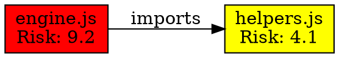

# Matrix Storage Examples and Templates

**Version**: 1.0  
**Last Updated**: 2025-07-22  
**Parent Document**: [`matrix-storage-format.md`](matrix-storage-format.md)

## Complete Format Examples

### YAML Format (Human-Readable)
**Usage**: Documentation, manual review, configuration templates

```yaml
matrix_metadata:
  version: "1.0"
  schema_version: "matrix-v1.0"
  generated_timestamp: "2025-07-22T14:30:00Z"

project_summary:
  health_score: 87.5
  total_files: 2847
  issues:
    critical: 3
    warning: 12
    info: 45

dependency_graph:
  nodes:
    - id: "node_001"
      path: "src/core/engine.js"
      risk_level: "high"
      complexity: 8.5
  
  relationships:
    - source: "src/core/engine.js"
      target: "src/utils/helpers.js"
      type: "dependency"
      critical_path: true
```

## Export Format Examples

### GraphViz DOT Format


### CSV Format (Tabular Export)
```csv
Source,Target,Relationship,Weight,Risk_Score,Critical_Path,Last_Modified
src/core/engine.js,src/utils/helpers.js,imports,0.85,9.2,true,2025-07-22T12:15:30Z
src/utils/helpers.js,src/models/data.js,imports,0.62,4.1,false,2025-07-21T16:45:12Z
```

### HTML Report Format
```html
<!DOCTYPE html>
<html>
<head>
    <title>Dependency Matrix Report - 2025-07-22</title>
    <meta charset="utf-8">
    <link rel="stylesheet" href="matrix-report.css">
</head>
<body>
    <div class="header">
        <h1>Project Health Report</h1>
        <div class="health-score">Health Score: <span class="score-87">87.5</span></div>
    </div>
    <div class="summary">
        <div class="metric">
            <label>Total Files:</label>
            <value>2,847</value>
        </div>
        <!-- Additional metrics -->
    </div>
    <!-- Interactive dependency visualization -->
    <div id="dependency-graph"></div>
</body>
</html>
```

## Configuration Templates

### Matrix Configuration Template
```json
{
  "matrix_config": {
    "scan_settings": {
      "root_directory": ".",
      "max_depth": 10,
      "follow_symlinks": false,
      "parallel_scanning": true,
      "cache_enabled": true
    },
    "file_patterns": {
      "include": ["*.js", "*.ts", "*.py", "*.go", "*.md", "*.json"],
      "exclude": [
        ".git/*",
        "node_modules/*", 
        "*.log",
        "*.tmp",
        ".cache/*"
      ]
    },
    "analysis_settings": {
      "complexity_calculation": "cyclomatic",
      "risk_assessment": "weighted_factors",
      "health_score_algorithm": "composite_v1",
      "critical_path_detection": "dijkstra_shortest"
    },
    "output_settings": {
      "default_format": "json",
      "compression": "gzip",
      "pretty_print": false,
      "include_metadata": true
    }
  }
}
```

### Exclusion Rules Template
```json
{
  "exclusion_rules": {
    "global_patterns": [
      ".git/**",
      "node_modules/**",
      "vendor/**",
      "dist/**",
      "build/**"
    ],
    "file_types": [
      "*.log",
      "*.tmp",
      "*.cache",
      "*.lock",
      "*.pid"
    ],
    "directories": [
      ".vscode",
      ".idea",
      "__pycache__",
      ".pytest_cache"
    ],
    "custom_rules": [
      {
        "pattern": "test/**/*.spec.js",
        "reason": "test_files_excluded_from_production_analysis",
        "enabled": true
      },
      {
        "pattern": "docs/legacy/**",
        "reason": "deprecated_documentation", 
        "enabled": false
      }
    ]
  }
}
```

### Validation Rules Template
```json
{
  "validation_rules": {
    "dependency_validation": {
      "check_file_existence": true,
      "validate_import_paths": true,
      "detect_circular_dependencies": true,
      "warn_on_unused_imports": true
    },
    "health_checks": {
      "missing_documentation_threshold": 0.8,
      "complexity_warning_threshold": 7.0,
      "complexity_error_threshold": 10.0,
      "risk_score_alert_threshold": 8.5
    },
    "critical_path_rules": {
      "max_depth_from_entry": 5,
      "failure_impact_assessment": true,
      "redundancy_analysis": true,
      "bottleneck_detection": true
    },
    "custom_validators": [
      {
        "name": "security_review_required",
        "pattern": "src/auth/**/*.js",
        "rule": "requires_security_documentation",
        "severity": "error"
      }
    ]
  }
}
```

## Usage Examples

### Command Line Operations
```bash
# Generate matrix with custom configuration
matrix-maintenance --config=custom-config.json --output=dependency-matrix.json

# Export to multiple formats
matrix-maintenance --export-csv --export-dot --export-html

# Validate existing matrix
matrix-maintenance --validate --input=existing-matrix.json

# Compare matrices
matrix-maintenance --compare=old-matrix.json,new-matrix.json --diff-output=changes.json

# Import from external format
matrix-maintenance --import=package.json --format=npm --merge-with=current-matrix.json
```

### API Usage Examples
```bash
# REST API calls
curl -X GET "http://localhost:8080/api/matrix/export?format=json&date_range=last_7_days"

curl -X POST "http://localhost:8080/api/matrix/import" \
  -H "Content-Type: application/json" \
  -d @external-matrix.json

curl -X GET "http://localhost:8080/api/matrix/health?component=core"

# Webhook configuration
curl -X POST "http://localhost:8080/api/webhooks" \
  -H "Content-Type: application/json" \
  -d '{
    "url": "https://alerts.company.com/matrix-webhook",
    "events": ["health_score_changed", "critical_issue_detected"],
    "authentication": "bearer_token",
    "token": "your_secure_token_here"
  }'
```

## Monitoring and Alerting Templates

### Health Score Alert Template
```json
{
  "alert_configuration": {
    "health_score_alerts": [
      {
        "threshold": 75,
        "severity": "warning",
        "message": "Project health score below acceptable threshold",
        "actions": ["notify_team", "create_ticket"]
      },
      {
        "threshold": 50,
        "severity": "critical",
        "message": "Project health score critically low - immediate attention required",
        "actions": ["page_oncall", "escalate_to_management", "block_deployments"]
      }
    ],
    "dependency_alerts": [
      {
        "condition": "broken_dependencies > 0",
        "severity": "error",
        "message": "Broken dependencies detected in project",
        "actions": ["notify_developers", "create_fix_ticket"]
      },
      {
        "condition": "circular_dependencies > 0",
        "severity": "warning", 
        "message": "Circular dependencies detected - refactoring recommended",
        "actions": ["notify_architects", "schedule_review"]
      }
    ]
  }
}
```

### Performance Monitoring Template
```json
{
  "performance_monitoring": {
    "metrics": [
      {
        "name": "matrix_generation_time",
        "unit": "seconds",
        "warning_threshold": 120,
        "critical_threshold": 300
      },
      {
        "name": "file_scan_rate",
        "unit": "files_per_second",
        "warning_threshold": 100,
        "critical_threshold": 50
      },
      {
        "name": "memory_usage",
        "unit": "megabytes",
        "warning_threshold": 400,
        "critical_threshold": 500
      }
    ],
    "reporting": {
      "interval": "5_minutes",
      "retention": "30_days",
      "aggregation": "average",
      "export_format": "prometheus"
    }
  }
}
```

## Integration Examples

### CI/CD Pipeline Integration
```yaml
# GitHub Actions example
name: Matrix Validation
on: [push, pull_request]

jobs:
  validate-dependencies:
    runs-on: ubuntu-latest
    steps:
      - uses: actions/checkout@v3
      
      - name: Generate Dependency Matrix
        run: |
          matrix-maintenance --generate --output=current-matrix.json
          
      - name: Validate Matrix Health
        run: |
          matrix-maintenance --validate --health-threshold=75 --input=current-matrix.json
          
      - name: Compare with Main Branch
        if: github.event_name == 'pull_request'
        run: |
          git checkout origin/main -- .matrix/current/dependency-matrix.json
          matrix-maintenance --compare=.matrix/current/dependency-matrix.json,current-matrix.json
          
      - name: Upload Matrix Artifact
        uses: actions/upload-artifact@v3
        with:
          name: dependency-matrix
          path: current-matrix.json
```

### Docker Integration
```dockerfile
# Multi-stage build with matrix validation
FROM node:16-alpine AS matrix-builder
WORKDIR /app
COPY package*.json ./
RUN npm install --only=production

COPY . .
RUN matrix-maintenance --generate --validate --health-threshold=80

FROM node:16-alpine AS production
WORKDIR /app
COPY --from=matrix-builder /app/node_modules ./node_modules
COPY --from=matrix-builder /app/.matrix ./.matrix
COPY . .

EXPOSE 3000
CMD ["npm", "start"]
```

---

**Reference Links**:
- **Main Document**: [`matrix-storage-format.md`](matrix-storage-format.md)
- **Technical Specs**: [`matrix-storage-technical-specs.md`](matrix-storage-technical-specs.md)
- **Performance Specs**: [`matrix-storage-performance-specs.md`](matrix-storage-performance-specs.md)