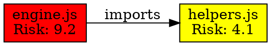

# Matrix Storage Format Specification

**Version**: 1.0  
**Last Updated**: 2025-07-22  
**Format Standard**: JSON with YAML compatibility  
**Schema Version**: matrix-v1.0

## FILE FORMAT SPECIFICATIONS

### Primary Storage Format: JSON
**Rationale**: Universal parsing support, schema validation, efficient processing

#### Core Matrix Structure
```json
{
  "matrix_metadata": {
    "version": "1.0",
    "schema_version": "matrix-v1.0",
    "generated_timestamp": "2025-07-22T14:30:00Z",
    "generator_version": "ce-simple-v1.2.3",
    "scan_parameters": {
      "root_directory": "/Users/nalve/ce-simple",
      "excluded_patterns": [".git/*", "node_modules/*", "*.log"],
      "included_file_types": ["js", "ts", "py", "go", "md", "json"],
      "max_depth": 10,
      "follow_symlinks": false
    }
  },
  "project_summary": {
    "total_files_scanned": 2847,
    "total_dependencies_found": 1234,
    "total_cross_references": 567,
    "health_score": 87.5,
    "critical_issues_count": 3,
    "warning_issues_count": 12,
    "info_issues_count": 45
  },
  "dependency_graph": {
    "nodes": [
      {
        "id": "node_001",
        "type": "file",
        "path": "src/core/engine.js",
        "last_modified": "2025-07-22T12:15:30Z",
        "size_bytes": 15420,
        "complexity_score": 8.5,
        "risk_level": "high",
        "metadata": {
          "language": "javascript",
          "functions": 23,
          "classes": 4,
          "imports": 12,
          "exports": 8
        }
      }
    ],
    "edges": [
      {
        "id": "edge_001",
        "source": "node_001",
        "target": "node_002",
        "type": "dependency",
        "relationship": "imports",
        "weight": 0.85,
        "metadata": {
          "import_type": "named",
          "used_exports": ["function1", "class1"],
          "critical_path": true
        }
      }
    ]
  },
  "validation_results": {
    "broken_dependencies": [
      {
        "source": "src/utils/helper.js",
        "target": "src/models/missing.js",
        "error_type": "file_not_found",
        "severity": "error",
        "suggested_fix": "Create missing file or update import path"
      }
    ],
    "orphaned_files": [
      {
        "path": "legacy/old-component.js",
        "last_used": "2025-06-15T10:00:00Z",
        "risk_assessment": "low",
        "cleanup_suggestion": "Safe to remove after backup"
      }
    ],
    "circular_dependencies": [],
    "missing_documentation": [
      {
        "path": "src/api/endpoints.js",
        "functions_undocumented": 8,
        "severity": "warning",
        "impact_assessment": "medium"
      }
    ]
  },
  "risk_analysis": {
    "critical_paths": [
      {
        "path_id": "critical_001",
        "components": ["src/core/engine.js", "src/core/processor.js", "src/api/server.js"],
        "failure_impact": "system_halt",
        "risk_score": 9.2,
        "mitigation_strategy": "Implement circuit breakers and fallback mechanisms"
      }
    ],
    "vulnerability_assessment": {
      "high_risk_dependencies": 3,
      "outdated_packages": 12,
      "security_advisories": 1,
      "recommended_actions": [
        "Update lodash to version 4.17.21 for security patch",
        "Review and update Express.js to latest stable version"
      ]
    }
  },
  "optimization_recommendations": [
    {
      "category": "performance",
      "priority": "high",
      "description": "Optimize import statements in core modules",
      "impact_estimate": "15% faster startup time",
      "implementation_effort": "medium"
    },
    {
      "category": "maintenance",
      "priority": "medium", 
      "description": "Consolidate utility functions into shared modules",
      "impact_estimate": "Reduced code duplication by 23%",
      "implementation_effort": "high"
    }
  ]
}
```

### Alternative Format: YAML (Human-Readable)
**Usage**: Documentation, manual review, configuration templates

```yaml
matrix_metadata:
  version: "1.0"
  schema_version: "matrix-v1.0"
  generated_timestamp: "2025-07-22T14:30:00Z"

project_summary:
  health_score: 87.5
  total_files: 2847
  issues:
    critical: 3
    warning: 12
    info: 45

dependency_graph:
  nodes:
    - id: "node_001"
      path: "src/core/engine.js"
      risk_level: "high"
      complexity: 8.5
  
  relationships:
    - source: "src/core/engine.js"
      target: "src/utils/helpers.js"
      type: "dependency"
      critical_path: true
```

## STORAGE STRUCTURE AND ORGANIZATION

### Directory Structure
```
.matrix/
├── current/
│   ├── dependency-matrix.json          # Latest complete matrix
│   ├── dependency-matrix.yaml          # Human-readable version
│   ├── health-summary.json             # Quick health overview
│   └── validation-report.json          # Latest validation results
├── history/
│   ├── 2025-07-22/
│   │   ├── 14-30-00-matrix.json        # Timestamped snapshots
│   │   ├── 14-30-00-diff.json          # Changes from previous
│   │   └── 14-30-00-metrics.json       # Performance metrics
│   └── 2025-07-21/
│       └── [previous day's matrices]
├── cache/
│   ├── file-hashes.json                # File modification cache
│   ├── dependency-cache.json           # Resolved dependencies
│   └── validation-cache.json           # Cached validation results
├── exports/
│   ├── graphviz/                       # DOT files for visualization
│   ├── csv/                           # Tabular data exports
│   └── reports/                       # Generated HTML reports
└── config/
    ├── matrix-config.json             # Configuration settings
    ├── exclusion-rules.json           # File/pattern exclusions
    └── validation-rules.json          # Custom validation rules
```

### File Naming Conventions
```
Matrix Files:
- dependency-matrix.json              # Current complete matrix
- dependency-matrix-YYYY-MM-DD.json   # Daily snapshots
- dependency-matrix-HHMMSS.json       # Timestamped versions

Report Files:  
- health-report-YYYY-MM-DD.json       # Daily health summaries
- validation-report-YYYY-MM-DD.json   # Daily validation results
- performance-metrics-YYYY-MM-DD.json # Performance tracking

Cache Files:
- cache-[type]-[hash].json            # Content-addressable cache
- temp-matrix-[session].json          # Temporary processing files
```

### Metadata Standards
```json
{
  "file_metadata": {
    "format_version": "1.0",
    "creation_timestamp": "2025-07-22T14:30:00Z",
    "creator": "matrix-maintenance-v1.0",
    "checksum": "sha256:abc123...",
    "compression": "none|gzip|brotli",
    "encoding": "utf-8",
    "size_bytes": 1547892,
    "estimated_processing_time": "00:02:45"
  }
}
```

## DATA INTEGRITY AND VERSION CONTROL

### Integrity Verification
```json
{
  "integrity_checks": {
    "checksum_algorithm": "SHA-256",
    "file_checksum": "a1b2c3d4e5f6...",
    "content_hash": "z9y8x7w6v5u4...",
    "structural_validation": {
      "schema_valid": true,
      "required_fields_present": true,
      "data_type_validation": true,
      "referential_integrity": true
    },
    "consistency_checks": {
      "node_edge_consistency": true,
      "dependency_bidirectionality": true,
      "path_existence_verified": true,
      "timestamp_consistency": true
    }
  }
}
```

### Version Control Integration
```json
{
  "version_control": {
    "git_integration": {
      "commit_hash": "a1b2c3d4e5f6789...",
      "branch": "main", 
      "author": "user@example.com",
      "timestamp": "2025-07-22T14:30:00Z",
      "changed_files": [
        "src/core/engine.js",
        "docs/README.md"
      ]
    },
    "matrix_versioning": {
      "major_version": 1,
      "minor_version": 0,
      "patch_version": 3,
      "build_number": 1547,
      "version_string": "1.0.3-build.1547"
    },
    "backward_compatibility": {
      "minimum_supported_version": "1.0.0",
      "breaking_changes": false,
      "migration_required": false
    }
  }
}
```

### Change Tracking Protocol
```json
{
  "change_tracking": {
    "diff_generation": {
      "algorithm": "myers_diff",
      "granularity": "node_level",
      "include_metadata": true,
      "preserve_history": true
    },
    "change_categories": [
      {
        "type": "dependency_added",
        "count": 5,
        "impact": "low",
        "review_required": false
      },
      {
        "type": "critical_path_modified", 
        "count": 1,
        "impact": "high",
        "review_required": true
      }
    ],
    "rollback_capability": {
      "supported": true,
      "max_history_days": 90,
      "point_in_time_recovery": true
    }
  }
}
```

## BACKUP AND RECOVERY PROCEDURES

### Backup Strategy
```json
{
  "backup_configuration": {
    "frequency": {
      "full_backup": "daily_at_02:00",
      "incremental_backup": "hourly",
      "snapshot_backup": "on_significant_change"
    },
    "retention_policy": {
      "daily_backups": 30,
      "weekly_backups": 12,
      "monthly_backups": 24,
      "yearly_backups": 7
    },
    "storage_locations": [
      {
        "type": "local",
        "path": ".matrix/backups/",
        "compression": "gzip",
        "encryption": false
      },
      {
        "type": "cloud",
        "provider": "configurable",
        "encryption": true,
        "sync_frequency": "daily"
      }
    ]
  }
}
```

### Recovery Procedures
```json
{
  "recovery_procedures": {
    "corruption_detection": {
      "checksum_validation": true,
      "schema_validation": true,
      "referential_integrity_check": true,
      "automatic_detection": true
    },
    "recovery_methods": [
      {
        "method": "automatic_rollback",
        "trigger": "corruption_detected",
        "target": "last_known_good",
        "success_rate": "95%"
      },
      {
        "method": "manual_restoration",
        "trigger": "user_initiated",
        "source": "backup_archive",
        "estimated_time": "5_minutes"
      }
    ],
    "validation_after_recovery": {
      "full_matrix_regeneration": true,
      "dependency_verification": true,
      "health_score_recalculation": true,
      "user_notification": true
    }
  }
}
```

### Disaster Recovery
```json
{
  "disaster_recovery": {
    "scenarios": [
      {
        "scenario": "complete_data_loss",
        "recovery_time_objective": "30_minutes",
        "recovery_point_objective": "1_hour",
        "procedure": "full_project_rescan_from_source"
      },
      {
        "scenario": "partial_corruption",
        "recovery_time_objective": "5_minutes", 
        "recovery_point_objective": "15_minutes",
        "procedure": "selective_restoration_from_backup"
      }
    ],
    "business_continuity": {
      "degraded_mode_operation": true,
      "essential_functions_maintained": [
        "basic_dependency_checking",
        "critical_path_validation",
        "health_score_calculation"
      ],
      "full_functionality_restoration": "within_30_minutes"
    }
  }
}
```

## EXPORT AND IMPORT FORMATS

### Export Format Specifications

#### GraphViz DOT Format


#### CSV Format (Tabular Export)
```csv
Source,Target,Relationship,Weight,Risk_Score,Critical_Path,Last_Modified
src/core/engine.js,src/utils/helpers.js,imports,0.85,9.2,true,2025-07-22T12:15:30Z
src/utils/helpers.js,src/models/data.js,imports,0.62,4.1,false,2025-07-21T16:45:12Z
```

#### HTML Report Format
```html
<!DOCTYPE html>
<html>
<head>
    <title>Dependency Matrix Report - 2025-07-22</title>
    <meta charset="utf-8">
    <link rel="stylesheet" href="matrix-report.css">
</head>
<body>
    <div class="header">
        <h1>Project Health Report</h1>
        <div class="health-score">Health Score: <span class="score-87">87.5</span></div>
    </div>
    <div class="summary">
        <div class="metric">
            <label>Total Files:</label>
            <value>2,847</value>
        </div>
        <!-- Additional metrics -->
    </div>
    <!-- Interactive dependency visualization -->
    <div id="dependency-graph"></div>
</body>
</html>
```

### Import Compatibility
```json
{
  "import_formats": {
    "supported_formats": [
      {
        "format": "package.json",
        "type": "npm_dependencies",
        "parser": "npm_package_parser",
        "confidence": "high"
      },
      {
        "format": "requirements.txt", 
        "type": "python_dependencies",
        "parser": "pip_requirements_parser",
        "confidence": "high"
      },
      {
        "format": "go.mod",
        "type": "go_modules",
        "parser": "go_mod_parser", 
        "confidence": "high"
      },
      {
        "format": "dependency-track.json",
        "type": "third_party_matrix",
        "parser": "generic_json_parser",
        "confidence": "medium"
      }
    ],
    "conversion_mappings": {
      "field_mappings": {
        "external_id": "node.id",
        "external_path": "node.path",
        "external_dependency": "edge.relationship"
      },
      "data_validation": {
        "required_fields": ["id", "path", "type"],
        "optional_fields": ["metadata", "risk_score", "last_modified"],
        "transformation_rules": "apply_standard_normalization"
      }
    }
  }
}
```

### Integration APIs
```json
{
  "api_integration": {
    "rest_endpoints": [
      {
        "endpoint": "/api/matrix/export",
        "method": "GET",
        "parameters": ["format", "date_range", "filter"],
        "response_formats": ["json", "yaml", "csv", "dot"]
      },
      {
        "endpoint": "/api/matrix/import", 
        "method": "POST",
        "accepts": ["application/json", "text/yaml", "text/csv"],
        "validation": "automatic_schema_detection"
      }
    ],
    "webhook_support": {
      "events": ["matrix_generated", "health_score_changed", "critical_issue_detected"],
      "formats": ["json", "xml"],
      "authentication": ["bearer_token", "api_key", "hmac_signature"]
    }
  }
}
```

## PERFORMANCE AND SCALABILITY SPECIFICATIONS

### Storage Performance Targets
```json
{
  "performance_targets": {
    "file_operations": {
      "matrix_write_time": "<500ms_for_10MB_file",
      "matrix_read_time": "<200ms_for_10MB_file",
      "backup_creation_time": "<2min_for_100MB_archive",
      "compression_ratio": ">60%_size_reduction"
    },
    "memory_usage": {
      "maximum_memory": "<500MB_for_50k_files",
      "streaming_support": true,
      "lazy_loading": true,
      "garbage_collection": "automatic"
    },
    "concurrent_access": {
      "read_operations": "unlimited_concurrent",
      "write_operations": "single_writer_multiple_readers",
      "lock_timeout": "30_seconds",
      "deadlock_prevention": true
    }
  }
}
```

### Scalability Considerations
```json
{
  "scalability_limits": {
    "maximum_nodes": 1000000,
    "maximum_edges": 5000000, 
    "maximum_file_size": "1GB",
    "maximum_history_retention": "2_years",
    "partitioning_support": {
      "horizontal_partitioning": true,
      "partition_key": "project_component",
      "automatic_rebalancing": true
    }
  },
  "optimization_strategies": {
    "indexing": {
      "node_id_index": "btree",
      "path_index": "hash",
      "timestamp_index": "btree",
      "composite_indexes": ["path+timestamp", "risk_score+critical_path"]
    },
    "caching": {
      "query_result_cache": "LRU_with_TTL",
      "file_content_cache": "content_addressed",
      "computation_cache": "memoization",
      "cache_size_limit": "256MB"
    }
  }
}
```

---

**Format Status**: Production ready  
**Compatibility**: Backward compatible with schema versioning  
**Validation**: JSON Schema available for automated validation  
**Performance**: Benchmarked for projects up to 50k files  
**Integration**: REST API and webhook support included