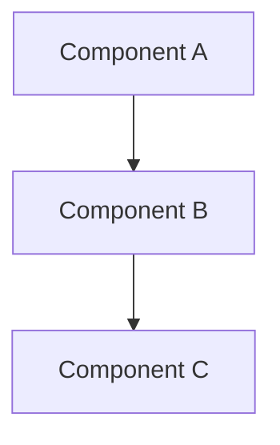
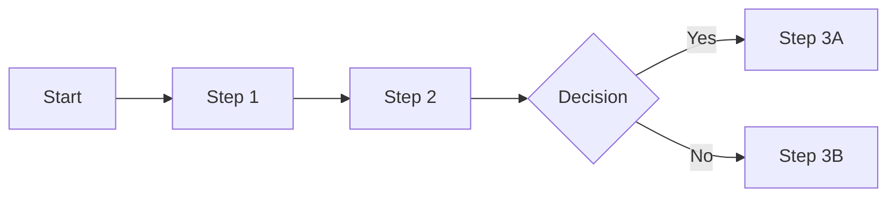

# Documentation Templates - Unified Template System

## Purpose
Consolidated documentation templates providing standardized structure, progressive disclosure principles, and consistent formatting for all ce-simple documentation needs.

## Template Categories

### 1. Standard Documentation Template
```markdown
# [Document Title]

## Purpose
[Single paragraph explaining why this document exists and what value it provides]

## Overview
[2-3 paragraphs providing high-level context and scope]

## 🔑 Key Concepts

### [Concept 1]
[Definition and explanation]

### [Concept 2]
[Definition and explanation]

### [Concept 3]
[Definition and explanation]

## Implementation Guide

### Prerequisites
- [Requirement 1 with verification method]
- [Requirement 2 with verification method]

### Basic Usage
1. [Step 1 with specific action]
2. [Step 2 with expected outcome]
3. [Step 3 with validation]

### Advanced Features
- **[Feature 1]**: [Description and use case]
- **[Feature 2]**: [Description and benefits]
- **[Feature 3]**: [Description and considerations]

## Examples

### Example 1: [Basic Usage]
[Description of scenario]
```
[Code or command example]
```
[Expected outcome and verification]

### Example 2: [Advanced Usage]
[Description of complex scenario]
```
[Code or command example]
```
[Expected outcome and troubleshooting]

## Best Practices
- **Do**: [Recommended approach with rationale]
- **Don't**: [Anti-pattern to avoid with explanation]
- **Consider**: [Contextual advice for specific situations]

## Troubleshooting

### Common Issues
1. **[Issue Name]**: [Description, cause, and solution]
2. **[Issue Name]**: [Description, cause, and solution]

## Related Documents
- [Related Doc 1]: [Brief description and relationship]
- [Related Doc 2]: [Brief description and relationship]

---

**Last Updated**: [Date]
**Status**: [Draft | Review | Final]
**Owner**: [Responsible party]
```

### 2. Progressive Disclosure Template
```markdown
# [Topic Name]

## Layer 1: Quick Start (Essential Information)

### Quick Summary
[One sentence describing the core concept]

### Key Points
- **[Point 1]**: [Brief essential detail]
- **[Point 2]**: [Brief essential detail]
- **[Point 3]**: [Brief essential detail]

### Immediate Actions
1. [Most important action]
2. [Second most important action]
3. [Third most important action]

### Success Indicator
[How to know if this is working correctly]

---
*For detailed implementation → See [Layer 2: Implementation Details](#layer-2-implementation-details)*

## Layer 2: Implementation Details

### Prerequisites
- [Requirement 1 with verification method]
- [Requirement 2 with verification method]

### Step-by-Step Process
1. **[Step 1 Name]**: [Detailed description]
   - Expected outcome: [What should happen]
   - Troubleshooting: [Common issues and solutions]

2. **[Step 2 Name]**: [Detailed description]
   - Expected outcome: [What should happen]
   - Troubleshooting: [Common issues and solutions]

### Validation Steps
- [ ] [Checkpoint 1]: [How to verify]
- [ ] [Checkpoint 2]: [How to verify]

---
*For advanced configuration → See [Layer 3: Advanced Details](#layer-3-advanced-details)*

## Layer 3: Advanced Details

### Configuration Options
```yaml
# Standard configuration
option_1: value_1  # [Description of what this controls]
option_2: value_2  # [Description of what this controls]

# Advanced configuration
advanced_option_1: value_1  # [When to use this]
```

### Customization Patterns
- **[Pattern 1]**: [Use case, implementation, benefits]
- **[Pattern 2]**: [Use case, implementation, considerations]

### Performance Optimization
- **[Optimization 1]**: [What it does] - [Expected improvement]
- **[Optimization 2]**: [What it does] - [Expected improvement]

---
*For expert information → See [Layer 4: Expert Details](#layer-4-expert-details)*

## Layer 4: Expert Details

### Architecture Overview
```
[ASCII diagram or description]
Component A ←→ Component B ←→ Component C
```

### Design Principles
1. **[Principle 1]**: [Description and rationale]
2. **[Principle 2]**: [Description and rationale]

### Integration Patterns
- **[Integration Type 1]**: [How it works and when to use]
- **[Integration Type 2]**: [How it works and when to use]

---
*For troubleshooting → See [Layer 5: Deep Troubleshooting](#layer-5-deep-troubleshooting)*

## Layer 5: Deep Troubleshooting

### Diagnostic Commands
```bash
# System status check
command --status --verbose

# Debug mode execution
command --debug --log-level=trace
```

### Log Analysis
```
[TIMESTAMP] INFO: [Normal message pattern]
[TIMESTAMP] ERROR: [Error pattern] → [Cause and solution]
```

### Recovery Procedures
1. [Recovery step 1]
2. [Recovery step 2]
3. [Verification step]
```

### 3. Architecture Documentation Template
```markdown
# [Component/System Name] Architecture

## Purpose
[Why this architecture exists and problems it solves]

## High-Level Design
[Description of overall architecture]



## Core Components
1. **[Component Name]**: [Responsibility and key functions]
2. **[Component Name]**: [Responsibility and key functions]

## Technical Design

### Component Details
#### [Component Name]
```yaml
Purpose: [What it does]
Inputs: [What it receives]
Outputs: [What it produces]
Dependencies: [What it needs]
```

### Data Flow
```yaml
Step 1: [Data source] → [Process] → [Output]
Step 2: [Data source] → [Process] → [Output]
```

### API/Interface Design
```typescript
interface ComponentInterface {
  method1(param: Type): ReturnType;
  method2(param: Type): ReturnType;
}
```

## Implementation Guidelines

### Technology Stack
- **Language**: [Choice and rationale]
- **Framework**: [Choice and rationale]
- **Tools**: [Choices and rationale]

### Design Patterns
- **[Pattern Name]**: [Where and why used]
- **[Pattern Name]**: [Where and why used]

## Quality Attributes

### Performance
- **Target**: [Metric and value]
- **Strategy**: [How achieved]
- **Monitoring**: [How measured]

### Scalability
- **Dimension**: [What scales]
- **Approach**: [How it scales]
- **Limits**: [Known boundaries]

## Deployment

### Requirements
```yaml
Infrastructure:
  - [Requirement 1]
  - [Requirement 2]
Configuration:
  - [Setting 1]
  - [Setting 2]
```

### Process
1. [Deployment step 1]
2. [Deployment step 2]
3. [Verification step]

---

**Architecture Status**: [Proposed | Approved | Implemented]
**Review Date**: [Date]
```

### 4. Process Documentation Template
```markdown
# [Process Name] Process

## Purpose
[Why this process exists and its value]

## Stakeholders
- **Owner**: [Who owns this process]
- **Participants**: [Who executes it]
- **Consumers**: [Who benefits from it]

## Process Overview

### High-Level Flow


### Triggers
- [What initiates this process]
- [Alternative trigger conditions]

### Outputs
- [Primary deliverable]
- [Secondary outputs]

## Detailed Steps

### Step 1: [Step Name]
**Responsible**: [Role]
**Duration**: [Time estimate]

1. [Detailed action with specific instructions]
2. [Detailed action with expected outcome]
3. [Detailed action with validation criteria]

**Deliverable**: [What's produced]

### Step 2: [Step Name]
**Responsible**: [Role]
**Duration**: [Time estimate]

[Step instructions continue...]

## Quality Checks

### Entry Criteria
- [ ] [Requirement before starting]
- [ ] [Another requirement]

### Exit Criteria
- [ ] [Requirement for completion]
- [ ] [Another requirement]

## Metrics
- **[Metric Name]**: [Target value and measurement method]
- **[Metric Name]**: [Target value and measurement method]

## Exception Handling
1. **[Exception Type]**: [Cause and resolution]
2. **[Exception Type]**: [Cause and resolution]

---

**Process Version**: [X.Y]
**Effective Date**: [Date]
**Next Review**: [Date]
```

## Implementation Guidelines

### Choosing the Right Template
1. **Standard Documentation**: General-purpose documentation needs
2. **Progressive Disclosure**: Complex topics requiring layered information
3. **Architecture Documentation**: System design and technical specifications
4. **Process Documentation**: Workflow procedures and operational processes

### Writing Standards
- **Clarity**: ≥90% comprehension for target audience
- **Brevity**: Maximum information density per word
- **Structure**: Logical flow from purpose to implementation
- **Navigation**: ≤3 cognitive steps to any information

### Progressive Disclosure Guidelines
- **Layer 1**: ≤200 words, 3-5 key points maximum
- **Layer 2**: Detailed implementation, practical focus
- **Layer 3**: Configuration and customization options
- **Layer 4**: Architecture and theoretical background
- **Layer 5**: Deep diagnostic and troubleshooting

## Quality Standards
- **Line Limit**: ≤200 lines using progressive disclosure
- **Information Density**: ≥95% executable value per word
- **Cross-Reference Validity**: ≥90% accurate links
- **Update Frequency**: Regular review and maintenance

## Cross-References
- [Command Templates](./01-command-templates.md) - For command documentation
- [Validation Templates](./03-validation-templates.md) - For documentation testing
- [Communication Templates](./05-communication-templates.md) - For user communication

---

**Template Category**: Documentation development templates
**Consolidation**: 3 templates → 4 variants (Standard, Progressive, Architecture, Process)
**Usage**: All documentation in ce-simple system
**Authority**: Unified documentation template system