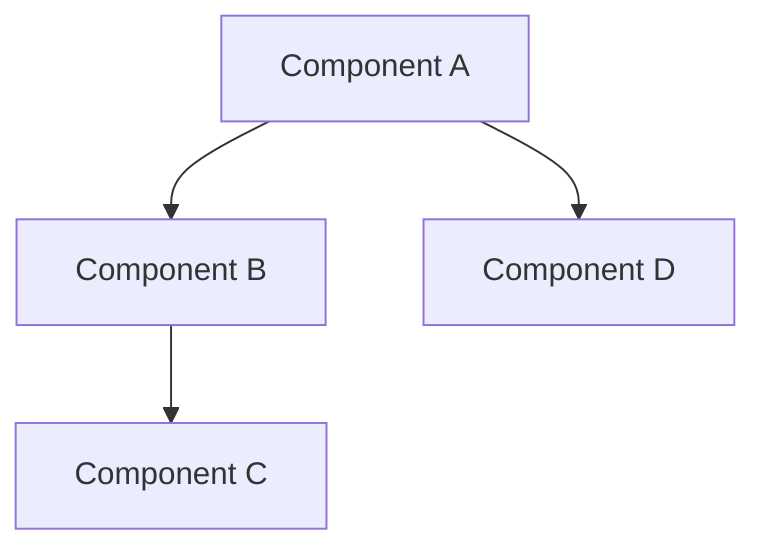
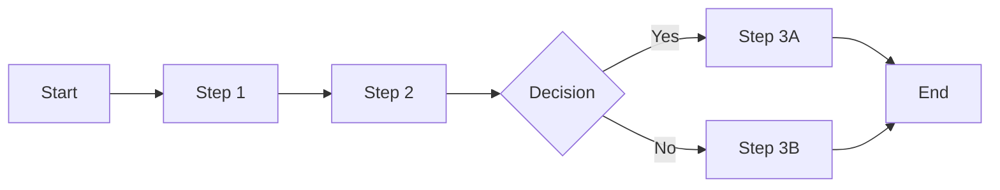

# Documentation Templates

## Standard Documentation Template

```markdown
# [Document Title]

## Purpose
[Single paragraph explaining why this document exists and what value it provides]

## Overview
[2-3 paragraphs providing high-level context and scope]

## 🔑 Key Concepts

### [Concept 1]
[Definition and explanation]

### [Concept 2]
[Definition and explanation]

### [Concept 3]
[Definition and explanation]

## Detailed Information

### [Section 1]
[Detailed content with examples]

```yaml
Example:
  key: value
  description: "what this demonstrates"
```

### [Section 2]
[Detailed content with code samples]

```javascript
// Example code
function example() {
  return "demonstration";
}
```

## Best Practices
- **Do**: [Recommended approach]
- **Don't**: [Anti-pattern to avoid]
- **Consider**: [Contextual advice]

## Common Pitfalls
1. **[Pitfall Name]**: [Description and how to avoid]
2. **[Pitfall Name]**: [Description and how to avoid]
3. **[Pitfall Name]**: [Description and how to avoid]

## Examples

### Example 1: [Basic Usage]
[Description]
```
[Code or command example]
```
[Expected outcome]

### Example 2: [Advanced Usage]
[Description]
```
[Code or command example]
```
[Expected outcome]

## Related Documents
- [Related Doc 1]: [Brief description]
- [Related Doc 2]: [Brief description]
- [Related Doc 3]: [Brief description]

## Notes
- [Important consideration]
- [Future enhancement idea]
- [Known limitation]

---

**Last Updated**: [Date]
**Status**: [Draft | Review | Final]
**Owner**: [Responsible party]
```

## Architecture Documentation Template

```markdown
# [Component/System Name] Architecture

## Purpose
[Why this architecture exists and problems it solves]

## Architectural Overview

### High-Level Design
[Description of overall architecture]



### Core Components
1. **[Component Name]**: [Responsibility]
2. **[Component Name]**: [Responsibility]
3. **[Component Name]**: [Responsibility]

## Technical Design

### Component Details

#### [Component Name]
```yaml
Purpose: [What it does]
Inputs: [What it receives]
Outputs: [What it produces]
Dependencies: [What it needs]
```

### Data Flow
```yaml
Step 1: [Data source] → [Process] → [Output]
Step 2: [Data source] → [Process] → [Output]
Step 3: [Data source] → [Process] → [Output]
```

### API/Interface Design
```typescript
interface ComponentInterface {
  method1(param: Type): ReturnType;
  method2(param: Type): ReturnType;
}
```

## Implementation Guidelines

### Technology Stack
- **Language**: [Choice and why]
- **Framework**: [Choice and why]
- **Tools**: [Choices and why]

### Design Patterns
- **[Pattern Name]**: [Where and why used]
- **[Pattern Name]**: [Where and why used]

### Code Organization
```
component/
├── core/           # Core logic
├── interfaces/     # API definitions
├── utils/          # Helper functions
└── tests/          # Test suite
```

## 🎯 Quality Attributes

### Performance
- **Target**: [Metric and value]
- **Strategy**: [How achieved]
- **Monitoring**: [How measured]

### Scalability
- **Dimension**: [What scales]
- **Approach**: [How it scales]
- **Limits**: [Known boundaries]

### Security
- **Threats**: [What we protect against]
- **Measures**: [How we protect]
- **Validation**: [How we verify]

## Deployment

### Requirements
```yaml
Infrastructure:
  - [Requirement 1]
  - [Requirement 2]
Configuration:
  - [Setting 1]
  - [Setting 2]
```

### Process
1. [Step 1]
2. [Step 2]
3. [Step 3]

## Metrics & Monitoring

### Key Metrics
- **[Metric Name]**: [What it measures]
- **[Metric Name]**: [What it measures]

### Alerts
- **[Alert Name]**: [Condition and action]
- **[Alert Name]**: [Condition and action]

## Evolution Plan
- **Phase 1**: [Current capabilities]
- **Phase 2**: [Next enhancements]
- **Phase 3**: [Future vision]

---

**Architecture Status**: [Proposed | Approved | Implemented]
**Review Date**: [Date]
**Reviewers**: [Names]
```

## Pattern Documentation Template

```markdown
# [Pattern Name] Pattern

## 🎯 Intent
[One sentence description of what the pattern does]

## Motivation
[Why this pattern exists and what problem it solves]

## Structure

### Conceptual Model
[High-level description of pattern structure]

### Implementation Blueprint
```javascript
// Pattern structure
class PatternImplementation {
  // Core components
}
```

## Applicability

### Use When
- [Condition 1]
- [Condition 2]
- [Condition 3]

### Don't Use When
- [Anti-condition 1]
- [Anti-condition 2]

## Implementation

### Step-by-Step Guide
1. **[Step Name]**: [Detailed instruction]
2. **[Step Name]**: [Detailed instruction]
3. **[Step Name]**: [Detailed instruction]

### Code Example
```javascript
// Complete working example
function implementPattern() {
  // Implementation details
}
```

### Variations
- **[Variation Name]**: [When to use this variation]
- **[Variation Name]**: [When to use this variation]

## Benefits
- [Benefit 1]
- [Benefit 2]
- [Benefit 3]

## Trade-offs
- [Trade-off 1]
- [Trade-off 2]
- [Trade-off 3]

## Related Patterns
- **[Pattern Name]**: [How it relates]
- **[Pattern Name]**: [How it relates]

## Real-World Examples

### Example 1: [Use Case]
[Description of real implementation]
```javascript
// Actual code from project
```

### Example 2: [Use Case]
[Description of real implementation]
```javascript
// Actual code from project
```

## Performance Considerations
- **Time Complexity**: [Big O notation]
- **Space Complexity**: [Big O notation]
- **Optimization Tips**: [Specific advice]

---

**Pattern Maturity**: [Experimental | Proven | Standard]
**First Documented**: [Date]
**Last Updated**: [Date]
```

## Tool/Command Documentation Template

```markdown
# [Tool/Command Name]

## Purpose
[What this tool/command does and why you'd use it]

## Installation
```bash
# Installation commands
npm install tool-name
# or
/deploy-command command-name
```

## Quick Start
```bash
# Simplest usage example
tool-name [basic-args]
```

## Complete Usage

### Syntax
```
tool-name [options] <required> [optional]
```

### Options
| Option | Short | Description | Default |
|--------|-------|-------------|---------|
| --option-name | -o | What it does | value |
| --another | -a | What it does | value |

### Arguments
- `<required>`: Description of required argument
- `[optional]`: Description of optional argument

## Examples

### Basic Examples
```bash
# Example 1: Simple usage
tool-name file.txt

# Example 2: With options
tool-name --verbose file.txt

# Example 3: Multiple files
tool-name *.js
```

### Advanced Examples
```bash
# Example 1: Complex pipeline
tool-name --parallel=10 --strategy=aggressive "src/**/*.ts" | process-results

# Example 2: With configuration
tool-name --config=custom.yaml --output=results/

# Example 3: Scripting usage
for file in $(find . -name "*.js"); do
  tool-name --quiet "$file"
done
```

## Configuration

### Configuration File
```yaml
# config.yaml example
option1: value
option2: value
advanced:
  setting1: value
  setting2: value
```

### Environment Variables
- `TOOL_CONFIG`: Path to config file
- `TOOL_PARALLEL`: Default parallelization
- `TOOL_VERBOSE`: Enable verbose output

## 🎯 Common Use Cases

### Use Case 1: [Scenario]
```bash
# How to accomplish this scenario
tool-name --specific-options
```

### Use Case 2: [Scenario]
```bash
# How to accomplish this scenario
tool-name --other-options
```

## Troubleshooting

### Common Issues

#### Issue: [Error message]
**Cause**: [What causes this]
**Solution**: [How to fix it]
```bash
# Fix command
```

#### Issue: [Error message]
**Cause**: [What causes this]
**Solution**: [How to fix it]

## Advanced Topics

### Performance Tuning
[How to optimize performance]

### Integration
[How to integrate with other tools]

### Automation
[How to use in automated workflows]

## API Reference
[If applicable, detailed API documentation]

## Contributing
[How to contribute improvements]

---

**Version**: [X.Y.Z]
**License**: [License type]
**Support**: [Where to get help]
```

## Process Documentation Template

```markdown
# [Process Name] Process

## Purpose
[Why this process exists and its value]

## Stakeholders
- **Owner**: [Who owns this process]
- **Participants**: [Who executes it]
- **Consumers**: [Who benefits from it]

## Process Overview

### High-Level Flow


### Triggers
- [What initiates this process]
- [Alternative trigger]

### Outputs
- [What this process produces]
- [Secondary outputs]

## Detailed Steps

### Step 1: [Step Name]
**Responsible**: [Role]
**Duration**: [Time estimate]

1. [Detailed action]
2. [Detailed action]
3. [Detailed action]

**Deliverable**: [What's produced]

### Step 2: [Step Name]
**Responsible**: [Role]
**Duration**: [Time estimate]

[Instructions continue...]

## Quality Checks

### Entry Criteria
- [ ] [Requirement before starting]
- [ ] [Another requirement]

### Exit Criteria
- [ ] [Requirement for completion]
- [ ] [Another requirement]

### Checkpoints
1. **After Step X**: [What to verify]
2. **Before Step Y**: [What to validate]

## Metrics

### Performance Indicators
- **[Metric]**: [Target value]
- **[Metric]**: [Target value]

### Monitoring
- [How metrics are tracked]
- [Reporting frequency]

## Exception Handling

### Known Exceptions
1. **[Exception Type]**: 
   - Cause: [What triggers it]
   - Resolution: [How to handle]

2. **[Exception Type]**:
   - Cause: [What triggers it]
   - Resolution: [How to handle]

### Escalation Path
1. [First level escalation]
2. [Second level escalation]
3. [Final escalation]

## Tools & Resources

### Required Tools
- [Tool 1]: [Purpose]
- [Tool 2]: [Purpose]

### Templates
- [Template 1]: [When to use]
- [Template 2]: [When to use]

### References
- [Reference 1]: [What it provides]
- [Reference 2]: [What it provides]

## Continuous Improvement

### Review Cycle
- **Frequency**: [How often reviewed]
- **Participants**: [Who reviews]
- **Focus Areas**: [What to examine]

### Recent Improvements
- [Date]: [What changed and why]
- [Date]: [What changed and why]

### Planned Enhancements
- [Enhancement 1]: [Timeline]
- [Enhancement 2]: [Timeline]

---

**Process Version**: [X.Y]
**Effective Date**: [Date]
**Next Review**: [Date]
```

## Usage Guidelines

### Choosing the Right Template
1. **Standard Documentation**: General purpose docs
2. **Architecture Documentation**: System design docs
3. **Pattern Documentation**: Reusable patterns
4. **Tool Documentation**: Command/tool reference
5. **Process Documentation**: Workflow procedures

### Customization Guidelines
- Keep section headers consistent
- Add sections as needed
- Remove irrelevant sections
- Maintain visual hierarchy
- Use consistent formatting

### Quality Standards
- Clear, concise language
- Concrete examples
- Visual aids where helpful
- Complete information
- Regular updates

---

**Template Library Version**: 1.0
**Purpose**: Standardize documentation across ce-simple
**Principle**: Consistency enables efficiency